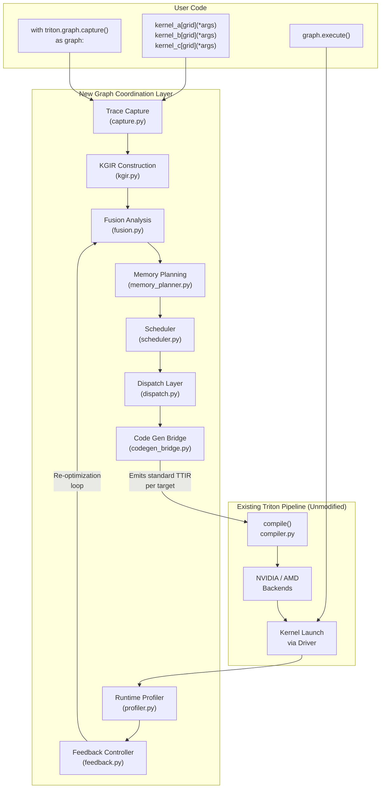

# 0. Agent Action Plan

## 0.1 Intent Clarification

### 0.1.1 Core Feature Objective

Based on the prompt, the Blitzy platform understands that the new feature requirement is to add a **graph-level cross-kernel optimization layer** to the Triton compiler that operates above the existing single-kernel compilation pipeline, encompassing cross-kernel fusion, inter-kernel scheduling, global memory planning, multi-target hardware-aware dispatch, and a closed-loop runtime feedback mechanism. The target repository is `triton-lang/triton`, `main` branch (version 3.6.0).

**Primary Feature Requirements:**

- **Kernel Graph IR (KGIR):** Create a new MLIR dialect extension that models a directed acyclic graph (DAG) of kernel launches, capturing per-node metadata (memory access patterns, tensor shapes, grid dimensions, shared memory usage, register pressure, hardware target annotations, runtime performance annotations) and per-edge relationships (data dependencies, anti-dependencies, resource conflicts, cross-device transfer edges). KGIR nodes are target-agnostic at construction and mutable for runtime annotation write-back. Hardware-specific information is encapsulated in a **Hardware Profile** descriptor attached at compilation, not baked into the IR.

- **Trace Capture Mechanism:** Implement a Python-level context manager and/or decorator that records kernel launches without executing them, capturing kernel function references, launch grid parameters, tensor arguments (pointers, shapes, strides, dtypes), constexpr values, and the full available hardware inventory (device vendor, architecture generation, memory capacity, interconnect topology). The mechanism must perform alias analysis on tensor pointer arguments and detect unsupported patterns (host-side control flow dependent on kernel output within trace scope).

- **Fusion Analysis Engine:** Develop producer-consumer fusion (pairs where Kernel A writes a tensor that Kernel B reads with no other consumers, compatible tiling, and combined resources within per-SM/CU limits) and sibling/horizontal fusion (independent kernels with compatible grid geometries merged into single launches with partitioned SM/CU allocation). Fusion decisions are per-target (fusibility varies by SMEM capacity, register file, warp/wavefront width). An adaptive two-phase cost model operates with cold-start static heuristics (Phase 1) transitioning to measured runtime data (Phase 2) per target.

- **Memory Planning Pass:** Analyze KGIR to identify intermediate tensors produced and consumed within the graph, perform liveness analysis, promote eligible intermediates from global memory to shared memory or register file across fused kernels (respecting per-target hardware limits from Hardware Profile), insert cross-device transfer operations when dispatch splits graphs across devices, and refine promotion decisions via runtime feedback.

- **Inter-Kernel Scheduler:** Analyze KGIR dependency graph for concurrently executable kernels, emit multi-stream launch sequences, apply resource-aware scheduling with critical-path analysis, coordinate multi-device launch sequences with synchronization barriers at cross-device edges, and refine stream assignments via runtime profiling feedback.

- **Hardware-Aware Dispatch Layer:** Enumerate all available GPU devices at trace time (vendor, architecture generation, compute capability, memory capacity, memory bandwidth, interconnect topology), compile each KGIR subgraph to multiple hardware targets in parallel, and select optimal hardware targets per subgraph based on five objectives (performance, cost, data locality, device utilization, memory capacity). Support three dispatch modes (`performance`, `cost`, `balanced`), intra-vendor cross-generation dispatch, and cross-vendor dispatch with explicit host-memory staging.

- **Runtime Profiler & Feedback Controller:** Instrument kernel launches with lightweight GPU timing (CUDA events, HIP events), capture per-kernel per-target metrics (wall-clock time, memory throughput, SM/CU occupancy, bandwidth, launch overhead, cross-device transfer time), feed measured data back into KGIR annotations, trigger re-optimization on prediction error exceeding configurable threshold, enforce monotonic improvement with rollback, and detect convergence (decision changes &lt; 2% across consecutive iterations). Maximum iteration cap of 20, configurable via `TRITON_FEEDBACK_MAX_ITERS`.

- **Code Generation Bridge:** Transform fused KGIR nodes back into valid TTIR per hardware target (differing tiling, SMEM allocation, grid dimensions per target), emitting standard Triton TTIR compilable by the unmodified existing pipeline. Must ensure numerical correctness (bitwise identity for deterministic ops, IEEE 754 bounds for non-deterministic) and efficient incremental recompilation of only affected fused kernels for affected targets.

- **TorchInductor Integration Surface:** Define a Python API contract for TorchInductor to submit kernel graphs, accept scheduling metadata hints and device placement preferences, and return optimized launch sequences. The feature works standalone; TorchInductor integration is optional.

**Implicit Requirements Detected:**

- A new KGIR MLIR dialect requires TableGen `.td` definitions under `include/triton/Dialect/`, C++ IR implementations under `lib/Dialect/`, and CMake integration into the existing build graph
- The Python-level trace capture must integrate with the existing `@triton.jit` / `JITFunction` / `KernelInterface` abstractions in `python/triton/runtime/jit.py` without modifying the existing `run()` path
- Per-target compilation parallelization requires integration with the existing `BaseBackend.add_stages()` pattern and `compile()` orchestration in `python/triton/compiler/compiler.py`
- New `TRITON_*` environment variables for observability must follow the existing knobs pattern in `python/triton/knobs.py`
- Hardware inventory enumeration must leverage the existing `GPUTarget` dataclass and `GPUDriver` in `python/triton/backends/`
- Cache key computation for graph-level artifacts must be compatible with the existing `FileCacheManager` and `RedisRemoteCacheBackend` infrastructure in `python/triton/runtime/cache.py`
- All new MLIR dialect registrations must be reflected in `bin/RegisterTritonDialects.h` for CLI toolchain compatibility

### 0.1.2 Special Instructions and Constraints

**Architectural Mandate — Strictly Additive:**

- MUST NOT modify any existing Triton MLIR passes, TTIR/TTGIR lowering, LLVM IR generation, backend implementations, Python API signatures for `@triton.jit`, kernel launch syntax, or cache key computation
- All existing tutorials and examples MUST produce identical compiled output
- Fused kernels emit standard TTIR compilable by the unmodified pipeline
- Zero regression on any existing single-kernel Triton compilation path

**Opt-In Only:**

- Existing Triton programs behave identically without modification
- Users opt in via explicit trace capture scope (context manager or decorator)

**Closed-Loop by Default:**

- When the graph optimization layer is active, runtime profiling and feedback are enabled automatically
- Users MAY disable feedback for single-pass static optimization via `TRITON_FEEDBACK_ENABLE=0`

**Multi-Target by Design:**

- KGIR, cost model, cache, and code generation bridge support multiple hardware backends and generations simultaneously from inception
- Single-target execution is a degenerate case of multi-target, not a separate code path

**No New External Dependencies:**

- KGIR MLIR dialect uses existing MLIR infrastructure from Triton's bundled LLVM build
- Cost model calibration data, Hardware Profile descriptors, and converged configuration caches are stored as JSON alongside existing hardware target configurations
- Runtime profiling uses CUDA event APIs and ROCm HIP event APIs already available in Triton's respective backend runtime environments
- Hardware inventory enumeration uses existing device query APIs (CUDA Runtime API, HIP Runtime API) already linked by Triton backends

**Minimal Change Clause:**

- Make only changes absolutely necessary for this feature
- Isolate all new code in dedicated files and modules
- Do not modify existing MLIR passes, Python APIs, or backend implementations
- When multiple implementation approaches exist, choose the least invasive one

**Novel Algorithm Investigation Mandate:**

- Scheduling algorithms (A1: resource-constrained DAG critical-path scheduler, A2: multi-device dispatch assignment, A3: communication-computation overlap scheduler) require dedicated investigation with minimum two candidate approaches each
- Closed-loop optimization algorithms (B1: adaptive cost model calibration, B2: fusion decision search & reversal, B3: convergence detection, B4: monotonic improvement enforcement, B5: dispatch reassignment & cold-start exploration) each require formal design with tradeoff analysis

### 0.1.3 Technical Interpretation

These feature requirements translate to the following technical implementation strategy:

- To **implement the KGIR MLIR dialect**, we will create a new dialect `TritonKGIR` under `include/triton/Dialect/TritonKGIR/` and `lib/Dialect/TritonKGIR/` following the established dialect pattern (TableGen `.td` definitions for operations/types/attributes, C++ `Dialect.cpp`/`Ops.cpp`/`Types.cpp` implementations), and register it via CMake `add_subdirectory` in `lib/Dialect/CMakeLists.txt` and `include/triton/Dialect/CMakeLists.txt`

- To **implement trace capture**, we will create a new Python module `python/triton/runtime/kernel_graph.py` with a `KernelGraphCapture` context manager that intercepts kernel launches, records metadata, and constructs KGIR programmatically via pybind11 bindings

- To **implement the fusion engine**, we will create `python/triton/graph/fusion.py` with producer-consumer and sibling fusion analysis operating on the KGIR, and a companion C++ analysis pass under `lib/Analysis/KGIRFusion.cpp` for performance-critical graph algorithms

- To **implement memory planning**, we will create `python/triton/graph/memory_planner.py` and `lib/Analysis/KGIRMemoryPlan.cpp` for liveness analysis and promotion decision-making

- To **implement inter-kernel scheduling**, we will create `python/triton/graph/scheduler.py` with stream assignment and critical-path analysis logic

- To **implement hardware-aware dispatch**, we will create `python/triton/graph/dispatch.py` with hardware inventory enumeration, multi-target compilation orchestration, and dispatch decision engine

- To **implement the runtime profiler and feedback controller**, we will create `python/triton/graph/profiler.py` and `python/triton/graph/feedback.py` for GPU event instrumentation, measurement collection, prediction error computation, re-optimization triggering, and convergence detection

- To **implement the code generation bridge**, we will create `python/triton/graph/codegen_bridge.py` that transforms fused KGIR nodes into valid TTIR, and a C++ pass `lib/Conversion/KGIRToTTIR/` for the MLIR-level IR transformation

- To **implement the TorchInductor integration surface**, we will create `python/triton/graph/torch_inductor_api.py` defining the public API contract

- To **add observability**, we will extend `python/triton/knobs.py` by creating a new `graph_knobs` domain class with all specified `TRITON_KGIR_*`, `TRITON_FUSION_*`, `TRITON_FEEDBACK_*`, and `TRITON_DISPATCH_*` environment variables

- To **add tests**, we will create `python/test/unit/graph/` and `python/test/integration/graph/` directories following existing pytest conventions, plus `test/KernelGraph/` for lit-based MLIR tests

## 0.2 Repository Scope Discovery

### 0.2.1 Comprehensive File Analysis — Existing Files Requiring Modification

The following existing files require targeted, minimal modifications to integrate the new graph-level coordination layer. All modifications are strictly additive (appending imports, adding `add_subdirectory` calls, extending registration lists) and do not alter existing behavior.

**Build System Files:**

| File Path | Modification Purpose |
| --- | --- |
| lib/Dialect/CMakeLists.txt | Add add_subdirectory(TritonKGIR) to register the new KGIR dialect in the build graph |
| include/triton/Dialect/CMakeLists.txt | Add add_subdirectory(TritonKGIR) to expose KGIR headers |
| lib/CMakeLists.txt | No change needed — already aggregates lib/Dialect/ |
| lib/Analysis/CMakeLists.txt | Add new KGIR analysis source files to the TritonAnalysis target |
| lib/Conversion/CMakeLists.txt | Add add_subdirectory(KGIRToTTIR) for the code generation bridge conversion pass |
| CMakeLists.txt (root) | No change needed — already aggregates include/ and lib/ |
| setup.py | No change needed — new Python modules auto-discovered via package structure |

**Backend / Dialect Registration:**

| File Path | Modification Purpose |
| --- | --- |
| bin/RegisterTritonDialects.h | Add #include "triton/Dialect/TritonKGIR/IR/Dialect.h" and registration calls for the KGIR dialect so CLI tools recognize KGIR operations |
| python/src/main.cc | Add KGIR dialect loading in the pybind11 module initialization if direct Python IR manipulation is exposed |
| python/src/passes.cc | Register KGIR-related MLIR passes for Python-level pass management |

**Python Package Integration:**

| File Path | Modification Purpose |
| --- | --- |
| python/triton/__init__.py | Add from . import graph to expose the new triton.graph subpackage in the public namespace |
| python/triton/knobs.py | Add a new graph_knobs domain class with all TRITON_KGIR_*, TRITON_FUSION_*, TRITON_FEEDBACK_*, and TRITON_DISPATCH_* environment variable descriptors |

**Test Infrastructure:**

| File Path | Modification Purpose |
| --- | --- |
| python/test/conftest.py | Add new pytest markers for graph-level tests (e.g., @pytest.mark.kernel_graph, @pytest.mark.multi_device) and hardware-gated skip logic |

### 0.2.2 Comprehensive File Analysis — Integration Point Discovery

**API Endpoints Connecting to the Feature:**

- `python/triton/runtime/jit.py` — `JITFunction.run()` and `KernelInterface.__getitem__()` are the kernel launch entry points; the trace capture mechanism must intercept launches dispatched through these paths without modifying their signatures
- `python/triton/compiler/compiler.py` — `compile()` function and `CompiledKernel` class orchestrate single-kernel compilation; the code generation bridge must invoke `compile()` with generated TTIR per target
- `python/triton/backends/compiler.py` — `BaseBackend`, `GPUTarget`, and `Language` define backend contracts; the dispatch layer consumes `GPUTarget` descriptors for hardware profiling
- `python/triton/backends/driver.py` — `GPUDriver` provides `get_current_target()` and device query capabilities; hardware inventory leverages this interface
- `python/triton/backends/__init__.py` — `_discover_backends()` and `backends` registry provide backend enumeration; dispatch layer consumes this to identify available compilation targets

**Database/Schema Updates:**

- No persistent database exists. The new cache entries for converged configurations will follow the existing `FileCacheManager` pattern in `python/triton/runtime/cache.py` using JSON serialization alongside existing cache artifacts at `~/.triton/cache/`.

**Service Classes Requiring Updates:**

- None — Triton is a library, not a service. All integration is via in-process Python function calls and pybind11 bindings.

**Middleware/Interceptors Impacted:**

- `python/triton/runtime/autotuner.py` — The `Autotuner` wraps `KernelInterface`; the trace capture mechanism must be compatible with autotuned kernels by capturing the selected configuration
- `python/triton/runtime/_async_compile.py` — `AsyncCompileMode` manages deferred compilation; graph-level multi-target compilation must be compatible with the async compilation flow

### 0.2.3 Web Search Research Conducted

**Best practices for graph-level kernel fusion in GPU compilers:**

- XLA's HLO fusion pass implements producer-consumer and multi-output fusion with cost-model-guided decisions on a dataflow graph — the KGIR design draws on this pattern
- TVM's Relay graph-level optimization uses a similar DAG-based fusion analysis with hardware-aware cost models

**MLIR dialect design patterns for graph-level IRs:**

- MLIR's `async` dialect provides patterns for multi-stream coordination and synchronization that inform the scheduler's barrier insertion strategy
- MLIR's `gpu` dialect demonstrates hardware-agnostic GPU operation modeling that informs KGIR's target-agnostic node design

**CUDA stream concurrency and multi-GPU dispatch patterns:**

- CUDA's stream-based concurrency model supports up to 128 concurrent streams per device; the scheduler must bound stream pool size for practical SM scheduling
- NVIDIA's Multi-Process Service (MPS) and CUDA Multi-Instance GPU (MIG) inform but are out of scope; dispatch assumes exclusive or fair-share device access

**Closed-loop compilation optimization systems:**

- Profile-Guided Optimization (PGO) in LLVM uses a two-phase compile-profile-recompile workflow; the feedback controller generalizes this to iterative convergence
- Autotuning frameworks (e.g., Triton's own `@triton.autotune`) demonstrate empirical performance search patterns that inform the adaptive cost model calibration

### 0.2.4 New File Requirements

**New Python Package:** `python/triton/graph/`

| File Path | Purpose |
| --- | --- |
| python/triton/graph/__init__.py | Package initialization; re-exports public API (capture, GraphConfig, DispatchMode) |
| python/triton/graph/capture.py | KernelGraphCapture context manager / @graph_trace decorator for recording kernel launch sequences without execution; alias analysis on tensor arguments; hardware inventory discovery |
| python/triton/graph/kgir.py | Python-side KGIR data structures: KGIRNode, KGIREdge, KGIRGraph, HardwareProfile descriptor; wraps C++ KGIR MLIR dialect via pybind11 |
| python/triton/graph/fusion.py | Fusion analysis engine: ProducerConsumerFusion, SiblingFusion, AdaptiveCostModel (two-phase heuristic→measured); per-target fusion plan generation |
| python/triton/graph/memory_planner.py | Memory planning pass: liveness analysis, global→shared/register promotion, cross-device transfer insertion, runtime contention-based refinement |
| python/triton/graph/scheduler.py | Inter-kernel scheduler: DAG critical-path analysis, multi-stream emission, resource-aware SM/CU bin-packing, multi-device coordination, communication-computation overlap |
| python/triton/graph/dispatch.py | Hardware-aware dispatch layer: HardwareInventory, multi-target compilation orchestration, DispatchDecisionEngine, dispatch modes (performance/cost/balanced), intra-vendor and cross-vendor routing |
| python/triton/graph/profiler.py | Runtime profiler: lightweight GPU event instrumentation (CUDA events / HIP events), per-kernel per-target metric collection, overhead budget enforcement (<3%) |
| python/triton/graph/feedback.py | Feedback controller: prediction error computation, re-optimization triggering, convergence detection, monotonic improvement enforcement with rollback, dispatch reassignment logic |
| python/triton/graph/codegen_bridge.py | Code generation bridge: fused KGIR node → valid TTIR transformation, per-target TTIR emission with target-specific tiling/SMEM/grid, incremental recompilation |
| python/triton/graph/cache.py | Graph-level cache: converged configuration caching per (kernel graph signature, hardware target set) tuple, validation run scheduling, cache invalidation triggers |
| python/triton/graph/config.py | Configuration dataclasses: GraphConfig, DispatchConfig, FeedbackConfig, FusionConfig, HardwareProfile |
| python/triton/graph/torch_inductor_api.py | TorchInductor integration surface: public API contract for kernel graph submission, scheduling hint acceptance, device placement preference handling |
| python/triton/graph/errors.py | Graph-specific exception hierarchy: GraphCaptureError, FusionError, DispatchError, ConvergenceError |
| python/triton/graph/utils.py | Shared utilities: DAG algorithms (topological sort, critical path, cycle detection), tensor shape/stride comparison helpers |

**New C++ MLIR Dialect: KGIR**

| File Path | Purpose |
| --- | --- |
| include/triton/Dialect/TritonKGIR/IR/CMakeLists.txt | CMake for KGIR IR TableGen targets and header generation |
| include/triton/Dialect/TritonKGIR/IR/TritonKGIRDialect.td | TableGen dialect definition for ttkgir namespace |
| include/triton/Dialect/TritonKGIR/IR/TritonKGIROps.td | TableGen operation definitions: KernelLaunchOp, DataDependencyOp, TransferOp, FusedKernelOp, GraphOp |
| include/triton/Dialect/TritonKGIR/IR/TritonKGIRTypes.td | TableGen type definitions: HardwareProfileType, NodeMetadataType, PerformanceAnnotationType |
| include/triton/Dialect/TritonKGIR/IR/TritonKGIRAttrDefs.td | TableGen attribute definitions for node/edge annotations |
| include/triton/Dialect/TritonKGIR/IR/Dialect.h | C++ header aggregating generated dialect definitions |
| include/triton/Dialect/TritonKGIR/CMakeLists.txt | CMake stub adding IR and Transforms subdirectories |
| include/triton/Dialect/TritonKGIR/Transforms/Passes.td | TableGen pass declarations for KGIR analysis/transformation passes |
| include/triton/Dialect/TritonKGIR/Transforms/Passes.h | C++ header for pass registration |
| lib/Dialect/TritonKGIR/CMakeLists.txt | CMake stub adding IR and Transforms subdirectories |
| lib/Dialect/TritonKGIR/IR/CMakeLists.txt | CMake for TritonKGIRIR library target |
| lib/Dialect/TritonKGIR/IR/Dialect.cpp | Dialect registration, type/op/attr loading |
| lib/Dialect/TritonKGIR/IR/Ops.cpp | Operation builders, verifiers, folders for KGIR ops |
| lib/Dialect/TritonKGIR/IR/Types.cpp | Type parsing/printing for KGIR custom types |
| lib/Dialect/TritonKGIR/Transforms/CMakeLists.txt | CMake for TritonKGIRTransforms library target |
| lib/Dialect/TritonKGIR/Transforms/FusionAnalysis.cpp | C++ implementation of fusion legality and cost model analysis as MLIR pass |
| lib/Dialect/TritonKGIR/Transforms/MemoryPlanning.cpp | C++ implementation of liveness analysis and memory promotion pass |
| lib/Dialect/TritonKGIR/Transforms/SchedulerPass.cpp | C++ implementation of critical-path scheduling and stream assignment pass |

**New C++ Conversion Pass:**

| File Path | Purpose |
| --- | --- |
| lib/Conversion/KGIRToTTIR/CMakeLists.txt | CMake for KGIRToTTIR conversion target |
| lib/Conversion/KGIRToTTIR/KGIRToTTIRPass.cpp | Fused KGIR node → TTIR conversion: kernel body merging, shared memory intermediate insertion, grid unification, SM partitioning for sibling fusion |
| include/triton/Conversion/KGIRToTTIR/Passes.td | TableGen pass declarations for the conversion |
| include/triton/Conversion/KGIRToTTIR/Passes.h | C++ header for pass registration |

**New PyBind11 Bindings:**

| File Path | Purpose |
| --- | --- |
| python/src/kgir.cc | PyBind11 bindings exposing KGIR IR construction, node/edge manipulation, graph traversal, and pass invocation to Python |

**New Test Files:**

| File Path | Purpose |
| --- | --- |
| python/test/unit/graph/__init__.py | Test package initialization |
| python/test/unit/graph/conftest.py | Graph test fixtures: mock kernel factories, hardware inventory mocks, sample KGIR graphs |
| python/test/unit/graph/test_capture.py | Unit tests for trace capture: kernel recording, alias analysis, error detection, hardware inventory |
| python/test/unit/graph/test_kgir.py | Unit tests for KGIR construction: node creation, edge creation, dependency analysis, metadata annotation |
| python/test/unit/graph/test_fusion.py | Unit tests for fusion analysis: producer-consumer positive/negative cases, sibling fusion, cost model accuracy, per-target fusion plans |
| python/test/unit/graph/test_memory_planner.py | Unit tests for memory planning: liveness analysis, promotion decisions, fallback to global memory, cross-device transfer insertion |
| python/test/unit/graph/test_scheduler.py | Unit tests for scheduler: critical-path computation, stream assignment, multi-device coordination, barrier insertion |
| python/test/unit/graph/test_dispatch.py | Unit tests for dispatch: hardware inventory, dispatch decision logic, mode selection, cross-device transfer cost modeling |
| python/test/unit/graph/test_profiler.py | Unit tests for profiler: event instrumentation, metric collection, overhead verification |
| python/test/unit/graph/test_feedback.py | Unit tests for feedback controller: prediction error computation, convergence detection, rollback enforcement, dispatch reassignment |
| python/test/unit/graph/test_codegen_bridge.py | Unit tests for code generation: fused TTIR correctness, per-target emission, incremental recompilation |
| python/test/unit/graph/test_cache.py | Unit tests for graph cache: signature computation, target set hashing, invalidation triggers |
| python/test/unit/graph/test_torch_inductor_api.py | Unit tests for TorchInductor API contract: submission, hint handling, return format |
| python/test/integration/graph/__init__.py | Integration test package |
| python/test/integration/graph/test_end_to_end.py | Full pipeline: trace → KGIR → fusion → TTIR → compiled binary → execution with numerical correctness per target |
| python/test/integration/graph/test_closed_loop.py | Full closed-loop: initial optimization → profiled execution → feedback → re-optimization → improvement validation |
| python/test/integration/graph/test_convergence.py | Convergence tests: stabilization within 20 iterations, monotonic improvement, revert-to-baseline |
| python/test/integration/graph/test_multi_target.py | Cross-target numerical equivalence, dispatch correctness, dispatch optimality on heterogeneous hardware |
| python/test/integration/graph/test_benchmarks.py | Benchmark suite: transformer blocks, conv chains, optimizer steps, multi-device scaling |
| test/KernelGraph/lit.cfg.py | Lit test configuration for KGIR MLIR-level tests |
| test/KernelGraph/test_kgir_ops.mlir | FileCheck-based MLIR tests for KGIR operation parsing/printing/verification |
| test/KernelGraph/test_fusion_pass.mlir | FileCheck-based tests for the fusion analysis MLIR pass |
| test/KernelGraph/test_kgir_to_ttir.mlir | FileCheck-based tests for the KGIR → TTIR conversion pass |

## 0.3 Dependency Inventory

### 0.3.1 Private and Public Packages

No new external dependencies are introduced. The feature uses exclusively existing packages and infrastructure already present in the Triton repository.

**Existing Packages Relevant to This Feature:**

| Registry | Package | Version | Purpose in Feature |
| --- | --- | --- | --- |
| PyPI | setuptools | >=40.8.0 | Build system for pip install -e python |
| PyPI | cmake | >=3.20, <4.0 | CMake build orchestration for new KGIR dialect and conversion passes |
| PyPI | ninja | >=1.11.1 | Parallel build driver for C++ compilation of KGIR dialect |
| PyPI | pybind11 | >=2.13.1 | C++ ↔ Python bindings for KGIR IR manipulation and pass invocation |
| PyPI | lit | (latest) | MLIR lit test execution for KGIR FileCheck tests |
| PyPI | numpy | (latest) | Numerical correctness validation in tests |
| PyPI | pytest | (latest) | Test framework for all graph-level Python tests |
| PyPI | pytest-xdist | (latest) | Parallel test execution for multi-target tests |
| PyPI | scipy | >=1.7.1 | Numerical analysis utilities in test validation |
| Bundled | LLVM/MLIR | Pinned commit ac5dc54d | MLIR infrastructure for KGIR dialect (TableGen, pass manager, IR builder) |
| Bundled | CUDA Runtime API | Via Triton NVIDIA backend | GPU event timing, device query, stream management for profiler and dispatch |
| Bundled | HIP Runtime API | Via Triton AMD backend | GPU event timing, device query, stream management for profiler and dispatch (AMD) |

**Hardware Profile Data (Stored as JSON):**

| Data | Storage Location | Purpose |
| --- | --- | --- |
| Hardware Profile descriptors | ~/.triton/cache/hw_profiles/ | Per-device SM count, SMEM capacity, register file size, memory bandwidth, compute throughput |
| Cost model calibration data | ~/.triton/cache/graph_calibration/ | Per-target launch overhead microbenchmark results, heuristic parameters |
| Converged configuration caches | ~/.triton/cache/graph_configs/ | Per (kernel graph signature, hardware target set) converged optimization configurations |
| Performance history logs | ~/.triton/cache/graph_history/ | Per-configuration execution time history for regression detection |

### 0.3.2 Dependency Updates

**Import Updates:**

New imports are limited to newly created modules. No existing imports are modified.

- Files matching `python/triton/graph/**/*.py` — Internal imports within the new `triton.graph` package
- `python/triton/__init__.py` — Single additive import: `from . import graph`
- `python/triton/knobs.py` — Addition of a new `graph_knobs` class alongside existing knob domain classes
- `python/test/unit/graph/**/*.py` — Test imports referencing `triton.graph.*` modules
- `python/test/integration/graph/**/*.py` — Integration test imports referencing `triton.graph.*` modules

**External Reference Updates:**

| File Pattern | Update Type | Details |
| --- | --- | --- |
| python/triton/knobs.py | New knob domain | Add graph_knobs class with all TRITON_KGIR_*, TRITON_FUSION_*, TRITON_FEEDBACK_*, TRITON_DISPATCH_* descriptors |
| bin/RegisterTritonDialects.h | New include | Add #include "triton/Dialect/TritonKGIR/IR/Dialect.h" and KGIR dialect registration |
| lib/Dialect/CMakeLists.txt | New subdirectory | Append add_subdirectory(TritonKGIR) |
| include/triton/Dialect/CMakeLists.txt | New subdirectory | Append add_subdirectory(TritonKGIR) |
| lib/Conversion/CMakeLists.txt | New subdirectory | Append add_subdirectory(KGIRToTTIR) |
| lib/Analysis/CMakeLists.txt | New sources | Add KGIR-specific analysis files if separate from dialect transforms |
| python/src/main.cc | Dialect loading | Add KGIR dialect loading in pybind11 module |
| python/src/passes.cc | Pass registration | Register KGIR passes for Python-level access |

**No Dependency Version Changes:**

- All existing package versions remain unchanged
- No new entries to `python/requirements.txt` or `python/test-requirements.txt`
- No changes to `pyproject.toml` build-system requires
- The root `CMakeLists.txt` requires no dependency changes — KGIR uses the same MLIR/LLVM libraries already linked

## 0.4 Integration Analysis

### 0.4.1 Existing Code Touchpoints

**Direct Modifications Required (Additive Only):**

- `python/triton/__init__.py` (line \~34, after existing imports): Add `from . import graph` to expose the new `triton.graph` subpackage. Add `"graph"` to `__all__` list. This enables `import triton; triton.graph.capture(...)` syntax.

- `python/triton/knobs.py` (after existing knob domain classes, approximately line \~500): Add `graph_knobs` class defining all new environment variable descriptors:

  ```python
  # TRITON_KGIR_DUMP, TRITON_FUSION_LOG, etc.
  ```

- `bin/RegisterTritonDialects.h` (after existing dialect includes, approximately line \~17): Add include for KGIR dialect header and registration call within `registerAllTritonDialects()`:

  ```cpp
  #include "triton/Dialect/TritonKGIR/IR/Dialect.h"
  ```

- `lib/Dialect/CMakeLists.txt` (after existing `add_subdirectory` calls): Append `add_subdirectory(TritonKGIR)` after the existing Gluon entry.

- `include/triton/Dialect/CMakeLists.txt` (after existing `add_subdirectory` calls): Append `add_subdirectory(TritonKGIR)` after the existing Gluon entry.

- `lib/Conversion/CMakeLists.txt` (after existing `add_subdirectory` calls): Append `add_subdirectory(KGIRToTTIR)` after the existing `TritonInstrumentToLLVM` entry.

- `python/src/main.cc` (within module initialization): Add KGIR dialect loading to ensure Python-level IR manipulation can construct and inspect KGIR operations.

- `python/src/passes.cc` (within pass registration): Register KGIR analysis and transformation passes so they are accessible from Python via `triton._C.libtriton`.

- `python/test/conftest.py` (within `pytest_configure`): Add custom markers `kernel_graph`, `multi_device`, `heterogeneous_hw` for test gating based on hardware availability.

### 0.4.2 Dependency Injections

The new graph-level coordination layer consumes existing Triton services through well-defined interfaces without modifying those services:

- **Backend Registry** (`python/triton/backends/__init__.py`): The dispatch layer reads the `backends` registry (populated by `_discover_backends()`) to enumerate available compilation targets. Consumed read-only; no modification to the registry or discovery mechanism.

- **Compilation Pipeline** (`python/triton/compiler/compiler.py`): The code generation bridge invokes the existing `compile()` function with generated TTIR `IRSource` objects per target. The `compile()` function receives standard inputs and produces standard `CompiledKernel` outputs — the bridge is a client, not a modifier.

- **Backend Contracts** (`python/triton/backends/compiler.py`): The dispatch layer constructs `GPUTarget` instances and calls `BaseBackend.supports_target()`, `BaseBackend.add_stages()`, and `BaseBackend.hash()` through the existing abstract interface. No new abstract methods are added; the new layer is a consumer of the existing contract.

- **Cache Infrastructure** (`python/triton/runtime/cache.py`): Graph-level caches (`graph_configs/`, `graph_calibration/`, `graph_history/`) follow the `FileCacheManager` pattern using the same `get_cache_manager()` factory with graph-specific hash keys. The existing cache infrastructure is consumed, not modified.

- **Driver Abstraction** (`python/triton/backends/driver.py`): Hardware inventory enumeration extends the existing `GPUDriver.get_current_target()` pattern by querying additional device properties (memory capacity, bandwidth, interconnect) through the same CUDA/HIP runtime APIs already linked. The `GPUDriver` class is consumed, not modified.

### 0.4.3 Data Flow Through the System

The following diagram illustrates how the new graph-level layer integrates with the existing Triton compilation pipeline:



### 0.4.4 Cross-Component Communication Interfaces

| Source Component | Target Component | Interface | Data Exchanged |
| --- | --- | --- | --- |
| capture.py | kgir.py | Python function call | Kernel refs, grid params, tensor args, hardware inventory |
| kgir.py | fusion.py | Python object graph | KGIRGraph with nodes, edges, metadata |
| fusion.py | memory_planner.py | Python object graph | Updated KGIRGraph with fusion decisions annotated |
| memory_planner.py | scheduler.py | Python object graph | KGIRGraph with memory promotion decisions |
| scheduler.py | dispatch.py | Python object graph | KGIRGraph with stream assignments and scheduling order |
| dispatch.py | codegen_bridge.py | Dispatch plan + KGIRGraph | Per-subgraph → target mapping, transfer operations |
| codegen_bridge.py | compiler.py (existing) | compile(IRSource) call | Standard TTIR string per target |
| profiler.py | feedback.py | Python dict / dataclass | Per-kernel per-target timing metrics |
| feedback.py | kgir.py | Annotation write-back | Measured performance data written to KGIR node annotations |
| feedback.py | fusion.py / scheduler.py / dispatch.py | Re-optimization trigger | Signal to re-run analysis with updated cost model data |
| graph/cache.py | runtime/cache.py (existing) | FileCacheManager consumption | Graph-specific cache entries following existing cache patterns |

## 0.5 Technical Implementation

### 0.5.1 File-by-File Execution Plan

**Group 1 — KGIR MLIR Dialect (C++ Foundation):**

- **CREATE:** `include/triton/Dialect/TritonKGIR/IR/TritonKGIRDialect.td` — TableGen dialect definition establishing `ttkgir` namespace, dependent dialects (`triton`, `ttg`), and dialect description
- **CREATE:** `include/triton/Dialect/TritonKGIR/IR/TritonKGIROps.td` — TableGen operation definitions: `ttkgir.kernel_launch` (represents a single kernel in the graph with metadata attributes), `ttkgir.data_dep` (data dependency edge), `ttkgir.anti_dep` (anti-dependency edge), `ttkgir.transfer` (cross-device data transfer), `ttkgir.fused_kernel` (result of fusion), `ttkgir.graph` (top-level container)
- **CREATE:** `include/triton/Dialect/TritonKGIR/IR/TritonKGIRTypes.td` — TableGen types: `HardwareProfileType` (SM count, SMEM, registers, bandwidth), `NodeMetadataType` (memory patterns, shapes, grid, resource usage), `PerformanceAnnotationType` (per-target measured metrics)
- **CREATE:** `include/triton/Dialect/TritonKGIR/IR/TritonKGIRAttrDefs.td` — TableGen attributes for memory access patterns, hardware target annotations, runtime performance data
- **CREATE:** `include/triton/Dialect/TritonKGIR/IR/Dialect.h` — Aggregate header including generated files
- **CREATE:** `lib/Dialect/TritonKGIR/IR/Dialect.cpp` — Dialect registration, type/op/attr loading, inliner interface
- **CREATE:** `lib/Dialect/TritonKGIR/IR/Ops.cpp` — Operation builders, verifiers (DAG acyclicity, resource constraint validation), folders, and canonicalization patterns
- **CREATE:** `lib/Dialect/TritonKGIR/IR/Types.cpp` — Type parsing/printing for hardware profiles, node metadata, performance annotations
- **CREATE:** CMake files: `include/triton/Dialect/TritonKGIR/CMakeLists.txt`, `include/triton/Dialect/TritonKGIR/IR/CMakeLists.txt`, `lib/Dialect/TritonKGIR/CMakeLists.txt`, `lib/Dialect/TritonKGIR/IR/CMakeLists.txt`
- **MODIFY:** `lib/Dialect/CMakeLists.txt` — Append `add_subdirectory(TritonKGIR)`
- **MODIFY:** `include/triton/Dialect/CMakeLists.txt` — Append `add_subdirectory(TritonKGIR)`
- **MODIFY:** `bin/RegisterTritonDialects.h` — Add KGIR dialect include and registration

**Group 2 — KGIR MLIR Transforms and Conversion:**

- **CREATE:** `include/triton/Dialect/TritonKGIR/Transforms/Passes.td` — TableGen pass declarations for `FusionAnalysisPass`, `MemoryPlanningPass`, `SchedulerPass`
- **CREATE:** `include/triton/Dialect/TritonKGIR/Transforms/Passes.h` — Pass registration header
- **CREATE:** `lib/Dialect/TritonKGIR/Transforms/CMakeLists.txt` — Build target for `TritonKGIRTransforms`
- **CREATE:** `lib/Dialect/TritonKGIR/Transforms/FusionAnalysis.cpp` — Fusion legality checking, cost model evaluation, per-target fusion plan generation as MLIR pass
- **CREATE:** `lib/Dialect/TritonKGIR/Transforms/MemoryPlanning.cpp` — Liveness analysis, intermediate promotion, and contention detection as MLIR pass
- **CREATE:** `lib/Dialect/TritonKGIR/Transforms/SchedulerPass.cpp` — Critical-path analysis, stream assignment, and barrier insertion as MLIR pass
- **CREATE:** `include/triton/Conversion/KGIRToTTIR/Passes.td` — TableGen for KGIR → TTIR conversion pass
- **CREATE:** `include/triton/Conversion/KGIRToTTIR/Passes.h` — Conversion pass registration header
- **CREATE:** `lib/Conversion/KGIRToTTIR/CMakeLists.txt` — Build target for `KGIRToTTIR`
- **CREATE:** `lib/Conversion/KGIRToTTIR/KGIRToTTIRPass.cpp` — Conversion logic: producer-consumer body merging with shared memory intermediates, sibling body merging with SM partitioning, unified grid computation, per-target TTIR emission
- **MODIFY:** `lib/Conversion/CMakeLists.txt` — Append `add_subdirectory(KGIRToTTIR)`

**Group 3 — PyBind11 Bridge:**

- **CREATE:** `python/src/kgir.cc` — PyBind11 bindings for KGIR dialect: context creation, graph construction, node/edge manipulation, pass invocation, annotation read/write, TTIR emission
- **MODIFY:** `python/src/main.cc` — Add KGIR dialect loading and `kgir` submodule initialization
- **MODIFY:** `python/src/passes.cc` — Register KGIR passes for Python access

**Group 4 — Python Graph Package (Core Feature Logic):**

- **CREATE:** `python/triton/graph/__init__.py` — Public API: `capture()`, `GraphConfig`, `DispatchMode`, version gate
- **CREATE:** `python/triton/graph/capture.py` — `KernelGraphCapture` context manager intercepting kernel launches via monkey-patching of the `KernelInterface.__getitem__` return path (without modifying `JITFunction.run`), recording kernel function refs, grid params, tensor args with alias analysis using pointer equality and stride comparison, hardware inventory enumeration via `GPUDriver`
- **CREATE:** `python/triton/graph/kgir.py` — Python KGIR graph representation wrapping C++ MLIR KGIR dialect via pybind11; `KGIRNode` (kernel metadata), `KGIREdge` (dependency metadata), `KGIRGraph` (DAG container with topological sort), `HardwareProfile` (per-device descriptor)
- **CREATE:** `python/triton/graph/fusion.py` — `FusionEngine` with `ProducerConsumerAnalyzer` (single-consumer check, tiling compatibility, SMEM+register budget per target) and `SiblingFusionAnalyzer` (independence check, grid compatibility, combined resource check); `AdaptiveCostModel` with Phase 1 (heuristic: eliminated bytes, launch overhead, resource pressure, per-target calibration) and Phase 2 (measured: replace heuristics with runtime data per target)
- **CREATE:** `python/triton/graph/memory_planner.py` — `MemoryPlanner` with global→shared promotion using liveness intervals per target SMEM capacity from HardwareProfile, cross-device transfer insertion using dispatch plan, closed-loop refinement (revert promotion on occupancy degradation)
- **CREATE:** `python/triton/graph/scheduler.py` — `KernelScheduler` with DAG critical-path computation, ready-queue priority scheduling, resource-aware SM/CU bin-packing, multi-stream emission (bounded pool), multi-device synchronization barrier insertion, communication-computation overlap identification
- **CREATE:** `python/triton/graph/dispatch.py` — `HardwareInventory` (device enumeration via CUDA/HIP APIs), `DispatchDecisionEngine` (five-objective scoring per subgraph-device pair), dispatch plan generation, transfer operation insertion, mode switching (`performance`/`cost`/`balanced`)
- **CREATE:** `python/triton/graph/profiler.py` — `RuntimeProfiler` instrumenting launches with CUDA events (`cudaEventCreate/Record/Synchronize/ElapsedTime`) or HIP events; per-kernel per-target metric collection; overhead budget enforcement (&lt; 3%); metric aggregation
- **CREATE:** `python/triton/graph/feedback.py` — `FeedbackController` computing prediction error per decision, triggering re-optimization when error exceeds `TRITON_FEEDBACK_SENSITIVITY` (default 0.15), enforcing monotonic improvement with checkpoint/rollback, detecting convergence (&lt; 2% decision changes), capping iterations at `TRITON_FEEDBACK_MAX_ITERS` (default 20)
- **CREATE:** `python/triton/graph/codegen_bridge.py` — `CodeGenerationBridge` transforming fused KGIR nodes → valid TTIR per target via C++ `KGIRToTTIR` pass (invoked through pybind11), incremental recompilation (unchanged fused kernels served from cache), numerical correctness enforcement
- **CREATE:** `python/triton/graph/cache.py` — `GraphCacheManager` extending the existing cache pattern with keys based on `(kernel graph signature, hardware target set)`, supporting converged configuration persistence, validation run scheduling, and invalidation on hardware inventory change or driver update
- **CREATE:** `python/triton/graph/config.py` — `GraphConfig`, `DispatchConfig`, `FeedbackConfig`, `FusionConfig` dataclasses with defaults matching specification thresholds
- **CREATE:** `python/triton/graph/torch_inductor_api.py` — `submit_kernel_graph()`, `KernelGraphResult`, optional hint payloads, device placement preferences (soft/hard)
- **CREATE:** `python/triton/graph/errors.py` — `GraphCaptureError`, `FusionError`, `DispatchError`, `ConvergenceError`, `TransferError` inheriting from `triton.errors.TritonError`
- **CREATE:** `python/triton/graph/utils.py` — Topological sort, critical path computation, cycle detection, tensor shape compatibility checks, stride comparison helpers
- **MODIFY:** `python/triton/__init__.py` — Add `from . import graph` and `"graph"` to `__all__`

**Group 5 — Environment Configuration:**

- **MODIFY:** `python/triton/knobs.py` — Add `graph_knobs` class:
  - `kgir_dump`: `env_bool("TRITON_KGIR_DUMP")`
  - `fusion_log`: `env_bool("TRITON_FUSION_LOG")`
  - `fusion_disable`: `env_bool("TRITON_FUSION_DISABLE")`
  - `fusion_threshold`: `env_str("TRITON_FUSION_THRESHOLD", "0.10")`
  - `feedback_enable`: `env_bool("TRITON_FEEDBACK_ENABLE", True)`
  - `feedback_sensitivity`: `env_str("TRITON_FEEDBACK_SENSITIVITY", "0.15")`
  - `feedback_max_iters`: `env_int("TRITON_FEEDBACK_MAX_ITERS", 20)`
  - `feedback_log`: `env_bool("TRITON_FEEDBACK_LOG")`
  - `feedback_history_dump`: `env_opt_str("TRITON_FEEDBACK_HISTORY_DUMP")`
  - `dispatch_mode`: `env_str("TRITON_DISPATCH_MODE", "balanced")`
  - `dispatch_log`: `env_bool("TRITON_DISPATCH_LOG")`
  - `dispatch_targets`: `env_opt_str("TRITON_DISPATCH_TARGETS")`
  - `dispatch_cost_weights`: `env_opt_str("TRITON_DISPATCH_COST_WEIGHTS")`
  - `dispatch_latency_constraint`: `env_opt_str("TRITON_DISPATCH_LATENCY_CONSTRAINT")`
  - `dispatch_granularity`: `env_str("TRITON_DISPATCH_GRANULARITY", "subgraph")`

**Group 6 — Tests and Documentation:**

- **CREATE:** `python/test/unit/graph/` — Full unit test suite (13 test files as listed in §0.2.4)
- **CREATE:** `python/test/integration/graph/` — Integration test suite (5 test files as listed in §0.2.4)
- **CREATE:** `test/KernelGraph/` — Lit-based MLIR tests (3 test files as listed in §0.2.4)
- **MODIFY:** `python/test/conftest.py` — Add `kernel_graph`, `multi_device`, `heterogeneous_hw` markers with hardware gating

### 0.5.2 Implementation Approach per File

**Establish KGIR Foundation:**

- Create the KGIR MLIR dialect following the pattern of existing dialects (Triton in `lib/Dialect/Triton/`, Gluon in `lib/Dialect/Gluon/`): TableGen definitions → C++ implementations → CMake wiring → pybind11 bindings
- KGIR operations model kernel graph semantics (launch, dependency, transfer, fused kernel, graph container) rather than computation semantics, distinguishing it from existing compute-focused dialects

**Build Trace Capture Layer:**

- The `KernelGraphCapture` context manager wraps kernel execution by intercepting the callable returned by `KernelInterface.__getitem__()`, replacing it with a recording callable that captures arguments without forwarding to `JITFunction.run()`. On context exit, captured launches are assembled into a KGIR
- Alias analysis compares tensor data pointers and strides to identify shared memory regions across kernels, similar to the existing `Alias.cpp` analysis in `lib/Analysis/`

**Integrate with Existing Compilation:**

- The code generation bridge produces standard TTIR text representation and passes it to `compile()` via `IRSource` — the existing pipeline sees no difference from any other IR-level compilation
- Multi-target compilation invokes `compile()` once per target with the appropriate `GPUTarget`, reusing the existing backend stage pipeline (`add_stages()`) without modification
- Multi-target compilation is parallelizable using Python's `concurrent.futures.ThreadPoolExecutor`

**Implement Closed-Loop Feedback:**

- Initial execution uses Phase 1 heuristic cost model; profiler captures actual metrics
- Feedback controller compares predictions vs measurements, writes measured data back to KGIR node annotations, and triggers re-optimization when threshold exceeded
- Re-optimization re-runs fusion analysis, memory planning, scheduling, and dispatch with updated cost model, producing revised TTIR and recompiling only affected kernels on affected targets
- Convergence is detected when &lt; 2% of total decisions change; maximum 20 iterations enforced; monotonic improvement guaranteed via checkpoint/rollback

### 0.5.3 Novel Algorithm Investigation Plan

The specification mandates dedicated investigation and design for eight algorithmic challenges. For each, the implementation must investigate how the Triton codebase and MLIR infrastructure constrain the design space, enumerate at minimum two candidate approaches, analyze tradeoffs, and select with rationale.

**Scheduling Algorithms:**

- **A1 — Resource-Constrained DAG Critical-Path Scheduler:** Investigate priority functions (critical-path-remaining vs slack-based vs level-based vs hybrid), resource feasibility models (first-fit vs best-fit vs occupancy-threshold SM/CU bin-packing), and stream assignment strategies (1:1 per chain vs bounded pool vs dynamic allocation). Design must account for per-target execution time differences affecting critical-path weights.

- **A2 — Multi-Device Dispatch Assignment Algorithm:** Investigate optimization formulations (greedy topological-order vs weighted-score ranking vs relaxed ILP) meeting &lt; 1ms decision latency per subgraph. Design objective composition (single weighted scalar vs lexicographic vs Pareto-front). Data locality penalty must be grounded in PCIe/NVLink/Infinity Fabric transfer characteristics. Must prove chosen approach meets latency bound.

- **A3 — Communication-Computation Overlap Scheduler:** Investigate transfer-compute overlap identification from KGIR DAG, minimal synchronization barrier placement for correctness with maximal overlap, and applicability of double-buffering/pipelining strategies in conjunction with stream assignments from A1.

**Closed-Loop Optimization Algorithms:**

- **B1 — Adaptive Cost Model Calibration:** Investigate calibration update mechanisms (exponential moving average vs Bayesian update vs windowed replacement vs direct substitution), observation count thresholds before heuristic replacement, prediction confidence tracking, and calibration data persistence within KGIR annotations and cache.

- **B2 — Fusion Decision Search & Reversal:** Investigate search strategies over the 2^N fusion decision space (greedy one-flip vs batch multi-flip vs dependency-aware ordering) converging within the 20-iteration cap. Design reversal trigger logic (consecutive degradation count and sensitivity threshold interaction) and re-evaluation prioritization for rejected candidates. Must address per-target dimension (fusion may help on Target A but hurt on Target B).

- **B3 — Convergence Detection:** Specify counting method (denominator definition), measurement window (consecutive vs sliding vs cumulative), per-component vs global convergence, and interaction with monotonic improvement enforcer (whether reverts count as decision changes).

- **B4 — Monotonic Improvement Enforcement with Rollback:** Define "end-to-end performance" in multi-device context, checkpoint granularity (full vs partial rollback), exploration tolerance (budget for intermediate-degrading paths), and checkpoint storage cost interaction with configuration cache.

- **B5 — Dispatch Reassignment & Cold-Start Exploration:** Determine whether reassignment triggers blocking vs asynchronous recompilation, how single reassignment interacts with global convergence detection, and cold-start exploration policy for newly available devices (profiling iterations before keep/revert and interaction with overall iteration budget).

## 0.6 Scope Boundaries

### 0.6.1 Exhaustively In Scope

**New KGIR MLIR Dialect (C++):**

- `include/triton/Dialect/TritonKGIR/**/*.td` — All TableGen definitions
- `include/triton/Dialect/TritonKGIR/**/*.h` — All generated and hand-written headers
- `lib/Dialect/TritonKGIR/**/*.cpp` — All dialect IR and transform implementations
- `lib/Dialect/TritonKGIR/**/CMakeLists.txt` — All dialect build configurations

**New KGIR → TTIR Conversion Pass (C++):**

- `include/triton/Conversion/KGIRToTTIR/**/*` — Conversion pass headers and TableGen
- `lib/Conversion/KGIRToTTIR/**/*.cpp` — Conversion pass implementation

**New PyBind11 Bindings (C++):**

- `python/src/kgir.cc` — KGIR dialect Python bindings

**New Python Graph Package:**

- `python/triton/graph/**/*.py` — All graph-level coordination modules (capture, kgir, fusion, memory_planner, scheduler, dispatch, profiler, feedback, codegen_bridge, cache, config, torch_inductor_api, errors, utils)

**New Test Infrastructure:**

- `python/test/unit/graph/**/*.py` — All unit tests for graph modules
- `python/test/integration/graph/**/*.py` — All integration tests (end-to-end, closed-loop, convergence, multi-target, benchmarks)
- `test/KernelGraph/**/*.mlir` — All MLIR FileCheck lit tests for KGIR
- `test/KernelGraph/lit.cfg.py` — Lit test configuration

**Modified Build System Files (Additive Changes Only):**

- `lib/Dialect/CMakeLists.txt` (add_subdirectory for TritonKGIR)
- `include/triton/Dialect/CMakeLists.txt` (add_subdirectory for TritonKGIR)
- `lib/Conversion/CMakeLists.txt` (add_subdirectory for KGIRToTTIR)

**Modified Registration / Integration Files (Additive Changes Only):**

- `bin/RegisterTritonDialects.h` (KGIR dialect include and registration)
- `python/src/main.cc` (KGIR dialect loading)
- `python/src/passes.cc` (KGIR pass registration)
- `python/triton/__init__.py` (graph subpackage import)
- `python/triton/knobs.py` (graph_knobs domain class)
- `python/test/conftest.py` (graph test markers)

**Configuration Caches (Runtime-Generated):**

- `~/.triton/cache/hw_profiles/` — Hardware Profile descriptors
- `~/.triton/cache/graph_calibration/` — Cost model calibration data
- `~/.triton/cache/graph_configs/` — Converged optimization configurations
- `~/.triton/cache/graph_history/` — Performance history logs

**Environment Variables (New):**

| Category | Variables |
| --- | --- |
| Fusion & Graph | TRITON_KGIR_DUMP, TRITON_FUSION_LOG, TRITON_FUSION_DISABLE, TRITON_FUSION_THRESHOLD |
| Feedback Loop | TRITON_FEEDBACK_ENABLE, TRITON_FEEDBACK_SENSITIVITY, TRITON_FEEDBACK_MAX_ITERS, TRITON_FEEDBACK_LOG, TRITON_FEEDBACK_HISTORY_DUMP |
| Hardware Dispatch | TRITON_DISPATCH_MODE, TRITON_DISPATCH_LOG, TRITON_DISPATCH_TARGETS, TRITON_DISPATCH_COST_WEIGHTS, TRITON_DISPATCH_LATENCY_CONSTRAINT, TRITON_DISPATCH_GRANULARITY |

### 0.6.2 Explicitly Out of Scope

- **Existing Triton MLIR Passes:** No modifications to any pass in `lib/Dialect/Triton/Transforms/`, `lib/Dialect/TritonGPU/Transforms/`, `lib/Dialect/TritonNvidiaGPU/Transforms/`, `lib/Dialect/Gluon/Transforms/`, or `lib/Dialect/TritonInstrument/Transforms/`
- **Existing TTIR/TTGIR Lowering:** No modifications to `lib/Conversion/TritonToTritonGPU/` or `lib/Conversion/TritonGPUToLLVM/`
- **Existing LLVM IR Generation:** No modifications to `lib/Target/LLVMIR/`
- **Existing Backend Implementations:** No modifications to `third_party/nvidia/backend/compiler.py`, `third_party/amd/backend/compiler.py`, or their C driver files
- **Existing Python API Signatures:** `@triton.jit`, kernel launch syntax `kernel[grid](*args)`, `triton.compile()`, and all other public API signatures remain unchanged
- **Existing Cache Key Computation:** No modifications to `get_cache_key()` in `python/triton/runtime/cache.py`
- **Existing Tutorials and Examples:** `python/tutorials/**/*` and `python/examples/**/*` produce identical compiled output
- **Implicit Graph Extraction:** No automatic tracing from arbitrary Python; users must explicitly opt in via `triton.graph.capture()`
- **TorchInductor Internal Changes:** Only the API contract surface is defined; no modifications to TorchInductor's internal graph representation
- **ML-Based Cost Model:** Feedback uses direct measurement, not learned surrogates, in v1
- **Dynamic Shape Support in KGIR:** Static shapes only in v1
- **Network-Distributed Dispatch:** Single-host, multi-device only in v1
- **GPU Virtualization or Time-Sharing:** Dispatch assumes exclusive or fair-share access to physical devices
- **Custom Backend Development:** System supports any vendor with an existing Triton backend but does not create new backends
- **Performance Optimization of Existing Code:** No refactoring of existing code unrelated to integration
- **Proton Profiler Modifications:** `third_party/proton/` is not modified; the new graph profiler is independent
- **Unrelated Features or Modules:** `python/triton/language/`, `python/triton/experimental/gluon/`, `python/triton_kernels/`, `python/triton/tools/` are not modified

## 0.7 Rules for Feature Addition

### 0.7.1 Architectural Rules

- **Strictly Additive Mandate:** All changes must be additive. No existing Triton MLIR passes, TTIR/TTGIR lowering, LLVM IR generation, backend implementations, Python API signatures for `@triton.jit`, kernel launch syntax, or cache key computation may be modified. Violation of this rule invalidates the implementation.

- **Zero Regression Guarantee:** All existing single-kernel Triton compilation paths must produce identical output. Existing tutorials (`python/tutorials/**/*`) and examples (`python/examples/**/*`) must compile and execute identically. This must be verified by running the existing test suite after integration.

- **Opt-In Only:** Existing Triton programs must behave identically without modification. The graph optimization layer activates only when users explicitly enter a `triton.graph.capture()` scope. No implicit tracing, no automatic graph extraction, no side effects on programs that do not use the new API.

- **TTIR Emission Only:** The code generation bridge emits standard Triton TTIR only. It must NOT modify or depend on TTGIR, LLVM IR lowering, or any backend pass. Fused kernels must be compilable by the unmodified existing pipeline for any supported backend.

- **Isolation of New Code:** All new code resides in dedicated files and directories. New Python code in `python/triton/graph/`, new C++ code in `lib/Dialect/TritonKGIR/`, `lib/Conversion/KGIRToTTIR/`, and `python/src/kgir.cc`. Modifications to existing files are limited to additive integration hooks (imports, `add_subdirectory`, registration calls).

### 0.7.2 Performance Rules

- **Success Thresholds (Hard Requirements):**

  - Producer-consumer fusion eliminates ≥80% of identified redundant global memory round-trips between fusible kernel pairs
  - Sibling fusion reduces kernel launch count by ≥30% for optimizer-step workloads
  - End-to-end latency improvement ≥15% on transformer block sequences vs Triton sequential baseline after initial optimization pass
  - Closed-loop re-optimization achieves ≥5% additional improvement within 10 feedback iterations
  - Convergence within 20 iterations on stable workloads (decision changes &lt; 2%)
  - Multi-target dispatch selects optimal target within 5 feedback iterations
  - Dispatch decisions within ≤5% deviation from offline-profiled optimal

- **Performance Constraints (Hard Limits):**

  - Trace capture overhead: &lt; 5ms for graphs with ≤50 kernels
  - KGIR construction and analysis: &lt; 100ms for graphs with ≤50 kernels
  - Fusion code generation: &lt; 500ms per fused kernel pair per target
  - Multi-target compilation wall-clock: ≤ slowest single-target + 10% coordination overhead
  - Runtime profiling overhead: &lt; 3% of total kernel execution time
  - Feedback analysis and re-optimization decision: &lt; 50ms per iteration
  - Re-compilation of affected kernels: &lt; 1s per modified kernel per target
  - Hardware inventory enumeration: &lt; 10ms at trace capture time
  - Dispatch decision latency: &lt; 1ms per subgraph
  - Zero measurable overhead for non-graph kernels
  - KGIR memory overhead: &lt; 10MB for graphs with ≤100 kernels
  - Performance history log: &lt; 1MB per cached configuration

### 0.7.3 Correctness Rules

- **Numerical Correctness:** Fused kernels produce functionally identical results to unfused sequences. Bitwise identity for deterministic ops. Within IEEE 754 floating-point reassociation bounds for non-deterministic ops. Cross-target numerical equivalence validated within IEEE 754 bounds for all dispatch-eligible targets.

- **Dependency Preservation:** All data dependencies in the KGIR DAG must be honored. No race conditions may be introduced by multi-stream scheduling. Cross-device transfers must be correctly synchronized.

- **Monotonic Improvement:** The feedback loop must never produce a configuration worse than the previous best. If an iteration degrades performance, it must revert to the previous best configuration automatically.

- **Convergence Safety:** Maximum iteration cap (default 20) must be enforced even on adversarial workloads. Worst case behavior: reverts to unfused baseline on fastest single device.

- **Hardware Availability Resilience:** Device removal during execution must result in graceful re-dispatch with no correctness failure. Device addition must initiate cold-start profiling.

### 0.7.4 Design and Investigation Rules

- **Novel Algorithm Mandate:** For each of the eight specified algorithmic challenges (A1, A2, A3, B1, B2, B3, B4, B5), the implementation must: (1) investigate how the Triton codebase and MLIR infrastructure constrain the design space, (2) enumerate at minimum two candidate algorithmic approaches, (3) analyze tradeoffs against performance constraints, (4) select and justify the chosen approach with codebase-specific evidence. The first viable approach must NOT be adopted without comparative analysis.

- **Multi-Target by Design:** KGIR, cost model, cache, and code generation bridge must support multiple hardware backends and generations simultaneously from inception. Single-target execution is a degenerate case, not a separate code path.

- **Closed-Loop by Default:** When graph optimization is active, runtime profiling and feedback are automatically enabled. Users may disable feedback via `TRITON_FEEDBACK_ENABLE=0`.

### 0.7.5 Testing Rules

- **Hardware-Gated Tests:** Multi-device and heterogeneous tests must be gated by hardware inventory detection (skip gracefully when required hardware is unavailable), following existing Triton test conventions.

- **Test Conventions:** All tests use pytest. GPU-required tests are gated by hardware availability. Tests follow existing patterns in `python/test/`.

- **Benchmark Suite Required:** Transformer blocks (GPT-style attention + layernorm + MLP), convolutional chains (conv + batchnorm + relu), optimizer steps (Adam across 100+ parameter groups), multi-device scaling (2, 4, 8 GPUs), cross-generation dispatch (memory-bound vs compute-bound mixes).

- **Regression Tests Required:** Fused vs unfused execution on target workloads, first-pass vs converged performance comparison, per-target performance comparison, dispatch overhead validation (&lt; 1ms per subgraph for 100+ subgraph graphs).

## 0.8 References

### 0.8.1 Repository Files Searched

The following files were directly retrieved and analyzed to derive the conclusions in this Agent Action Plan:

**Root-Level Configuration:**

- `CMakeLists.txt` — Root CMake build configuration; confirmed MLIR/LLVM integration, dialect build pattern, pybind11 linkage, and C++17 standard
- `setup.py` — Python package build; confirmed `BackendInstaller`, `TRITON_PLUGIN_DIRS`, in-tree backend discovery from `third_party/`
- `pyproject.toml` — Build-system requires (setuptools &gt;=40.8.0, cmake &gt;=3.20, &lt;4.0, ninja &gt;=1.11.1, pybind11 &gt;=2.13.1); tool configuration (mypy, ruff, autopep8)
- `python/requirements.txt` — Build dependencies (setuptools, wheel, cmake, ninja, pybind11, lit)
- `python/test-requirements.txt` — Test dependencies (autopep8, isort, numpy, pytest, pytest-forked, pytest-xdist, scipy &gt;=1.7.1, llnl-hatchet, pandas &lt;3.0, expecttest, msgpack)

**Python Compiler Pipeline:**

- `python/triton/__init__.py` — Public API surface; version 3.6.0; re-exports from runtime, compiler, language
- `python/triton/compiler/__init__.py` — Compiler namespace exports (CompiledKernel, ASTSource, IRSource, compile, make_backend)
- `python/triton/compiler/compiler.py` — `compile()` orchestration, `ASTSource`, `IRSource`, `CompiledKernel`, stage pipeline, cache integration
- `python/triton/compiler/code_generator.py` — AST → TTIR lowering (CodeGenerator, ast_to_ttir)

**Runtime System:**

- `python/triton/runtime/jit.py` — `JITFunction`, `KernelInterface`, `DependenciesFinder`, kernel launch flow, specialization
- `python/triton/runtime/autotuner.py` — Autotuner, Config, Heuristics (compatibility consideration for trace capture)
- `python/triton/runtime/cache.py` — `FileCacheManager`, `RedisRemoteCacheBackend`, cache key computation
- `python/triton/runtime/driver.py` — Driver selection, `DriverConfig` singleton

**Backend Abstraction:**

- `python/triton/backends/__init__.py` — `_discover_backends()`, `backends` registry, `_find_concrete_subclasses`
- `python/triton/backends/compiler.py` — `GPUTarget`, `BaseBackend`, `Language` enum, `add_stages()` contract
- `python/triton/backends/driver.py` — `DriverBase`, `GPUDriver`, `Benchmarker` protocol

**NVIDIA Backend:**

- `third_party/nvidia/backend/compiler.py` — `CUDABackend`, `CUDAOptions`, `add_stages()` (TTIR→TTGIR→LLIR→PTX→CUBIN), `make_ttir()`/`make_ttgir()`/`make_llir()`/`make_ptx()`/`make_cubin()`
- `third_party/nvidia/backend/driver.py` — CUDA driver bootstrap, `CudaUtils`

**AMD Backend:**

- `third_party/amd/backend/compiler.py` — `HIPBackend`, `HIPOptions`, `add_stages()` (TTIR→TTGIR→LLIR→AMDGCN→HSACO)
- `third_party/amd/backend/driver.py` — HIP driver bootstrap, `HIPUtils`

**Language DSL:**

- `python/triton/language/__init__.py` — Namespace exports, `str_to_ty` parser
- `python/triton/language/core.py` — DSL primitives, dtype/tensor/block abstractions

**MLIR Dialect Infrastructure:**

- `lib/Dialect/CMakeLists.txt` — Dialect build aggregation (Triton, TritonGPU, TritonNvidiaGPU, TritonInstrument, Gluon)
- `include/triton/Dialect/CMakeLists.txt` — Dialect header aggregation
- `lib/Conversion/CMakeLists.txt` — Conversion pass aggregation

**Configuration:**

- `python/triton/knobs.py` — Knob system: `env_base` descriptors, domain classes, `TRITON_*` environment variables

**CLI / Registration:**

- `bin/RegisterTritonDialects.h` — Dialect registration pattern for CLI tools; includes for all existing dialects

**Testing Infrastructure:**

- `python/test/conftest.py` — Pytest configuration, markers, fixtures

### 0.8.2 Repository Folders Searched

| Folder Path | Depth Explored | Key Findings |
| --- | --- | --- |
| (root) | Level 0 | Repository structure: 13 top-level directories, CMake-driven build |
| python/ | Level 1 | Python package root with triton, test, tutorials, examples, src |
| python/triton/ | Level 2 | Core package: compiler, runtime, language, backends, knobs, tools, experimental |
| python/triton/compiler/ | Level 3 | 5 files: compiler.py (pipeline), code_generator.py (AST→TTIR), errors.py, make_launcher.py |
| python/triton/runtime/ | Level 3 | 10 files: jit.py, autotuner.py, cache.py, driver.py, build.py, interpreter.py, errors.py, _allocation.py, _async_compile.py |
| python/triton/backends/ | Level 3 | 3 files: init.py (discovery), compiler.py (BaseBackend/GPUTarget), driver.py (DriverBase/GPUDriver) |
| python/triton/language/ | Level 2 | 8 files: core.py, semantic.py, math.py, standard.py, random.py, target_info.py, extra/ |
| python/test/ | Level 2 | Test organization: conftest.py, unit/, backend/, gluon/, regression/, microbenchmark/ |
| python/test/unit/ | Level 3 | Subdirectories: cuda/, instrumentation/, language/, plugins/, runtime/, tools/ |
| lib/ | Level 1 | C++ implementation: Dialect/, Analysis/, Conversion/, Target/, Tools/ |
| lib/Dialect/ | Level 2 | 5 dialects: Triton, TritonGPU, TritonNvidiaGPU, TritonInstrument, Gluon |
| lib/Dialect/Triton/IR/ | Level 4 | Pattern for new dialect: Dialect.cpp, Ops.cpp, Types.cpp, Traits.cpp, Utility.cpp |
| include/triton/ | Level 1 | Headers: Conversion/, Dialect/, Target/, Tools/, Analysis/ |
| include/triton/Dialect/ | Level 2 | TableGen definitions for all 5 dialects |
| third_party/ | Level 1 | External: nvidia/, amd/, proton/, f2reduce/ |
| third_party/nvidia/backend/ | Level 3 | NVIDIA backend: compiler.py, driver.py, driver.c |
| third_party/amd/backend/ | Level 3 | AMD backend: compiler.py, driver.py, driver.c |
| bin/ | Level 2 | CLI tools: triton-opt, RegisterTritonDialects.h |

### 0.8.3 Technical Specification Sections Cross-Referenced

| Section | Content Retrieved | Relevance |
| --- | --- | --- |
| 1.1 Executive Summary | Project overview, version 3.6.0, stakeholders, business impact | Baseline project context and version confirmation |
| 2.1 Feature Catalog | All 16 existing features with metadata and dependencies | Identified integration points with F-002 (compiler), F-003 (backends), F-004 (autotuner), F-005 (caching), F-012 (knobs) |
| 3.1 Programming Languages | Python 3.10-3.14, C++17, MLIR TableGen | Confirmed language constraints for new code |
| 5.1 High-Level Architecture | System architecture, core components, data flow, external integrations | Confirmed pipeline stages, backend model, cache hierarchy |
| 6.1 Core Services Architecture | Not applicable (Triton is a library) | Confirmed all integration is in-process |
| 9.1 Environment Variable Reference | All existing TRITON_* variables | Naming convention reference for new graph-level variables |
| 9.6 Compilation Pipeline Stage Reference | NVIDIA and AMD pipeline stages | Confirmed TTIR → TTGIR → LLVM IR → binary per-backend paths |
| 9.7 MLIR Dialect Reference | Five existing dialects | Confirmed dialect naming conventions and analysis library structure |

### 0.8.4 Attachments

No attachments were provided for this project. No Figma URLs were specified.

# 0. Agent Action Plan

## 0.1 Intent Clarification

### 0.1.1 Core Feature Objective

Based on the prompt, the Blitzy platform understands that the new feature requirement is to add a **graph-level cross-kernel optimization layer** to the Triton compiler that operates above the existing single-kernel compilation pipeline, encompassing cross-kernel fusion, inter-kernel scheduling, global memory planning, multi-target hardware-aware dispatch, and a closed-loop runtime feedback mechanism. The target repository is `triton-lang/triton`, `main` branch (version 3.6.0).

**Primary Feature Requirements:**

- **Kernel Graph IR (KGIR):** Create a new MLIR dialect extension that models a directed acyclic graph (DAG) of kernel launches, capturing per-node metadata (memory access patterns, tensor shapes, grid dimensions, shared memory usage, register pressure, hardware target annotations, runtime performance annotations) and per-edge relationships (data dependencies, anti-dependencies, resource conflicts, cross-device transfer edges). KGIR nodes are target-agnostic at construction and mutable for runtime annotation write-back. Hardware-specific information is encapsulated in a **Hardware Profile** descriptor attached at compilation, not baked into the IR.

- **Trace Capture Mechanism:** Implement a Python-level context manager and/or decorator that records kernel launches without executing them, capturing kernel function references, launch grid parameters, tensor arguments (pointers, shapes, strides, dtypes), constexpr values, and the full available hardware inventory (device vendor, architecture generation, memory capacity, interconnect topology). The mechanism must perform alias analysis on tensor pointer arguments and detect unsupported patterns (host-side control flow dependent on kernel output within trace scope).

- **Fusion Analysis Engine:** Develop producer-consumer fusion (pairs where Kernel A writes a tensor that Kernel B reads with no other consumers, compatible tiling, and combined resources within per-SM/CU limits) and sibling/horizontal fusion (independent kernels with compatible grid geometries merged into single launches with partitioned SM/CU allocation). Fusion decisions are per-target (fusibility varies by SMEM capacity, register file, warp/wavefront width). An adaptive two-phase cost model operates with cold-start static heuristics (Phase 1) transitioning to measured runtime data (Phase 2) per target.

- **Memory Planning Pass:** Analyze KGIR to identify intermediate tensors produced and consumed within the graph, perform liveness analysis, promote eligible intermediates from global memory to shared memory or register file across fused kernels (respecting per-target hardware limits from Hardware Profile), insert cross-device transfer operations when dispatch splits graphs across devices, and refine promotion decisions via runtime feedback.

- **Inter-Kernel Scheduler:** Analyze KGIR dependency graph for concurrently executable kernels, emit multi-stream launch sequences, apply resource-aware scheduling with critical-path analysis, coordinate multi-device launch sequences with synchronization barriers at cross-device edges, and refine stream assignments via runtime profiling feedback.

- **Hardware-Aware Dispatch Layer:** Enumerate all available GPU devices at trace time (vendor, architecture generation, compute capability, memory capacity, memory bandwidth, interconnect topology), compile each KGIR subgraph to multiple hardware targets in parallel, and select optimal hardware targets per subgraph based on five objectives (performance, cost, data locality, device utilization, memory capacity). Support three dispatch modes (`performance`, `cost`, `balanced`), intra-vendor cross-generation dispatch, and cross-vendor dispatch with explicit host-memory staging.

- **Runtime Profiler & Feedback Controller:** Instrument kernel launches with lightweight GPU timing (CUDA events, HIP events), capture per-kernel per-target metrics (wall-clock time, memory throughput, SM/CU occupancy, bandwidth, launch overhead, cross-device transfer time), feed measured data back into KGIR annotations, trigger re-optimization on prediction error exceeding configurable threshold, enforce monotonic improvement with rollback, and detect convergence (decision changes &lt; 2% across consecutive iterations). Maximum iteration cap of 20, configurable via `TRITON_FEEDBACK_MAX_ITERS`.

- **Code Generation Bridge:** Transform fused KGIR nodes back into valid TTIR per hardware target (differing tiling, SMEM allocation, grid dimensions per target), emitting standard Triton TTIR compilable by the unmodified existing pipeline. Must ensure numerical correctness (bitwise identity for deterministic ops, IEEE 754 bounds for non-deterministic) and efficient incremental recompilation of only affected fused kernels for affected targets.

- **TorchInductor Integration Surface:** Define a Python API contract for TorchInductor to submit kernel graphs, accept scheduling metadata hints and device placement preferences, and return optimized launch sequences. The feature works standalone; TorchInductor integration is optional.

**Implicit Requirements Detected:**

- A new KGIR MLIR dialect requires TableGen `.td` definitions under `include/triton/Dialect/`, C++ IR implementations under `lib/Dialect/`, and CMake integration into the existing build graph
- The Python-level trace capture must integrate with the existing `@triton.jit` / `JITFunction` / `KernelInterface` abstractions in `python/triton/runtime/jit.py` without modifying the existing `run()` path
- Per-target compilation parallelization requires integration with the existing `BaseBackend.add_stages()` pattern and `compile()` orchestration in `python/triton/compiler/compiler.py`
- New `TRITON_*` environment variables for observability must follow the existing knobs pattern in `python/triton/knobs.py`
- Hardware inventory enumeration must leverage the existing `GPUTarget` dataclass and `GPUDriver` in `python/triton/backends/`
- Cache key computation for graph-level artifacts must be compatible with the existing `FileCacheManager` and `RedisRemoteCacheBackend` infrastructure in `python/triton/runtime/cache.py`
- All new MLIR dialect registrations must be reflected in `bin/RegisterTritonDialects.h` for CLI toolchain compatibility

### 0.1.2 Special Instructions and Constraints

**Architectural Mandate — Strictly Additive:**

- MUST NOT modify any existing Triton MLIR passes, TTIR/TTGIR lowering, LLVM IR generation, backend implementations, Python API signatures for `@triton.jit`, kernel launch syntax, or cache key computation
- All existing tutorials and examples MUST produce identical compiled output
- Fused kernels emit standard TTIR compilable by the unmodified pipeline
- Zero regression on any existing single-kernel Triton compilation path

**Opt-In Only:**

- Existing Triton programs behave identically without modification
- Users opt in via explicit trace capture scope (context manager or decorator)

**Closed-Loop by Default:**

- When the graph optimization layer is active, runtime profiling and feedback are enabled automatically
- Users MAY disable feedback for single-pass static optimization via `TRITON_FEEDBACK_ENABLE=0`

**Multi-Target by Design:**

- KGIR, cost model, cache, and code generation bridge support multiple hardware backends and generations simultaneously from inception
- Single-target execution is a degenerate case of multi-target, not a separate code path

**No New External Dependencies:**

- KGIR MLIR dialect uses existing MLIR infrastructure from Triton's bundled LLVM build
- Cost model calibration data, Hardware Profile descriptors, and converged configuration caches are stored as JSON alongside existing hardware target configurations
- Runtime profiling uses CUDA event APIs and ROCm HIP event APIs already available in Triton's respective backend runtime environments
- Hardware inventory enumeration uses existing device query APIs (CUDA Runtime API, HIP Runtime API) already linked by Triton backends

**Minimal Change Clause:**

- Make only changes absolutely necessary for this feature
- Isolate all new code in dedicated files and modules
- Do not modify existing MLIR passes, Python APIs, or backend implementations
- When multiple implementation approaches exist, choose the least invasive one

**Novel Algorithm Investigation Mandate:**

- Scheduling algorithms (A1: resource-constrained DAG critical-path scheduler, A2: multi-device dispatch assignment, A3: communication-computation overlap scheduler) require dedicated investigation with minimum two candidate approaches each
- Closed-loop optimization algorithms (B1: adaptive cost model calibration, B2: fusion decision search & reversal, B3: convergence detection, B4: monotonic improvement enforcement, B5: dispatch reassignment & cold-start exploration) each require formal design with tradeoff analysis

### 0.1.3 Technical Interpretation

These feature requirements translate to the following technical implementation strategy:

- To **implement the KGIR MLIR dialect**, we will create a new dialect `TritonKGIR` under `include/triton/Dialect/TritonKGIR/` and `lib/Dialect/TritonKGIR/` following the established dialect pattern (TableGen `.td` definitions for operations/types/attributes, C++ `Dialect.cpp`/`Ops.cpp`/`Types.cpp` implementations), and register it via CMake `add_subdirectory` in `lib/Dialect/CMakeLists.txt` and `include/triton/Dialect/CMakeLists.txt`

- To **implement trace capture**, we will create a new Python module `python/triton/runtime/kernel_graph.py` with a `KernelGraphCapture` context manager that intercepts kernel launches, records metadata, and constructs KGIR programmatically via pybind11 bindings

- To **implement the fusion engine**, we will create `python/triton/graph/fusion.py` with producer-consumer and sibling fusion analysis operating on the KGIR, and a companion C++ analysis pass under `lib/Analysis/KGIRFusion.cpp` for performance-critical graph algorithms

- To **implement memory planning**, we will create `python/triton/graph/memory_planner.py` and `lib/Analysis/KGIRMemoryPlan.cpp` for liveness analysis and promotion decision-making

- To **implement inter-kernel scheduling**, we will create `python/triton/graph/scheduler.py` with stream assignment and critical-path analysis logic

- To **implement hardware-aware dispatch**, we will create `python/triton/graph/dispatch.py` with hardware inventory enumeration, multi-target compilation orchestration, and dispatch decision engine

- To **implement the runtime profiler and feedback controller**, we will create `python/triton/graph/profiler.py` and `python/triton/graph/feedback.py` for GPU event instrumentation, measurement collection, prediction error computation, re-optimization triggering, and convergence detection

- To **implement the code generation bridge**, we will create `python/triton/graph/codegen_bridge.py` that transforms fused KGIR nodes into valid TTIR, and a C++ pass `lib/Conversion/KGIRToTTIR/` for the MLIR-level IR transformation

- To **implement the TorchInductor integration surface**, we will create `python/triton/graph/torch_inductor_api.py` defining the public API contract

- To **add observability**, we will extend `python/triton/knobs.py` by creating a new `graph_knobs` domain class with all specified `TRITON_KGIR_*`, `TRITON_FUSION_*`, `TRITON_FEEDBACK_*`, and `TRITON_DISPATCH_*` environment variables

- To **add tests**, we will create `python/test/unit/graph/` and `python/test/integration/graph/` directories following existing pytest conventions, plus `test/KernelGraph/` for lit-based MLIR tests

## 0.2 Repository Scope Discovery

### 0.2.1 Comprehensive File Analysis — Existing Files Requiring Modification

The following existing files require targeted, minimal modifications to integrate the new graph-level coordination layer. All modifications are strictly additive (appending imports, adding `add_subdirectory` calls, extending registration lists) and do not alter existing behavior.

**Build System Files:**

| File Path | Modification Purpose |
| --- | --- |
| lib/Dialect/CMakeLists.txt | Add add_subdirectory(TritonKGIR) to register the new KGIR dialect in the build graph |
| include/triton/Dialect/CMakeLists.txt | Add add_subdirectory(TritonKGIR) to expose KGIR headers |
| lib/CMakeLists.txt | No change needed — already aggregates lib/Dialect/ |
| lib/Conversion/CMakeLists.txt | Add add_subdirectory(KGIRToTTIR) for the code generation bridge conversion pass |

> **Note:** `lib/Analysis/CMakeLists.txt` does not require modification. All KGIR analysis passes (fusion analysis, memory planning, scheduler) are placed under `lib/Dialect/TritonKGIR/Transforms/` following the established Triton dialect pattern where analysis passes co-locate with dialect transforms.\
> | `CMakeLists.txt` (root) | No change needed — already aggregates `include/` and `lib/` |\
> | `setup.py` | No change needed — new Python modules auto-discovered via package structure |

**Backend / Dialect Registration:**

| File Path | Modification Purpose |
| --- | --- |
| bin/RegisterTritonDialects.h | Add #include "triton/Dialect/TritonKGIR/IR/Dialect.h" and registration calls for the KGIR dialect so CLI tools recognize KGIR operations |
| python/src/main.cc | Add KGIR dialect loading in the pybind11 module initialization if direct Python IR manipulation is exposed |
| python/src/passes.cc | Register KGIR-related MLIR passes for Python-level pass management |

**Python Package Integration:**

| File Path | Modification Purpose |
| --- | --- |
| python/triton/__init__.py | Add from . import graph to expose the new triton.graph subpackage in the public namespace |
| python/triton/knobs.py | Add a new graph_knobs domain class with all TRITON_KGIR_*, TRITON_FUSION_*, TRITON_FEEDBACK_*, and TRITON_DISPATCH_* environment variable descriptors |

**Test Infrastructure:**

| File Path | Modification Purpose |
| --- | --- |
| python/test/conftest.py | Add new pytest markers for graph-level tests (e.g., @pytest.mark.kernel_graph, @pytest.mark.multi_device) and hardware-gated skip logic |

### 0.2.2 Comprehensive File Analysis — Integration Point Discovery

**API Endpoints Connecting to the Feature:**

- `python/triton/runtime/jit.py` — `JITFunction.run()` and `KernelInterface.__getitem__()` are the kernel launch entry points; the trace capture mechanism must intercept launches dispatched through these paths without modifying their signatures
- `python/triton/compiler/compiler.py` — `compile()` function and `CompiledKernel` class orchestrate single-kernel compilation; the code generation bridge must invoke `compile()` with generated TTIR per target
- `python/triton/backends/compiler.py` — `BaseBackend`, `GPUTarget`, and `Language` define backend contracts; the dispatch layer consumes `GPUTarget` descriptors for hardware profiling
- `python/triton/backends/driver.py` — `GPUDriver` provides `get_current_target()` and device query capabilities; hardware inventory leverages this interface
- `python/triton/backends/__init__.py` — `_discover_backends()` and `backends` registry provide backend enumeration; dispatch layer consumes this to identify available compilation targets

**Database/Schema Updates:**

- No persistent database exists. The new cache entries for converged configurations will follow the existing `FileCacheManager` pattern in `python/triton/runtime/cache.py` using JSON serialization alongside existing cache artifacts at `~/.triton/cache/`.

**Service Classes Requiring Updates:**

- None — Triton is a library, not a service. All integration is via in-process Python function calls and pybind11 bindings.

**Middleware/Interceptors Impacted:**

- `python/triton/runtime/autotuner.py` — The `Autotuner` wraps `KernelInterface`; the trace capture mechanism must be compatible with autotuned kernels by capturing the selected configuration
- `python/triton/runtime/_async_compile.py` — `AsyncCompileMode` manages deferred compilation; graph-level multi-target compilation must be compatible with the async compilation flow

### 0.2.3 Web Search Research Conducted

**Best practices for graph-level kernel fusion in GPU compilers:**

- XLA's HLO fusion pass implements producer-consumer and multi-output fusion with cost-model-guided decisions on a dataflow graph — the KGIR design draws on this pattern
- TVM's Relay graph-level optimization uses a similar DAG-based fusion analysis with hardware-aware cost models

**MLIR dialect design patterns for graph-level IRs:**

- MLIR's `async` dialect provides patterns for multi-stream coordination and synchronization that inform the scheduler's barrier insertion strategy
- MLIR's `gpu` dialect demonstrates hardware-agnostic GPU operation modeling that informs KGIR's target-agnostic node design

**CUDA stream concurrency and multi-GPU dispatch patterns:**

- CUDA's stream-based concurrency model supports up to 128 concurrent streams per device; the scheduler must bound stream pool size for practical SM scheduling
- NVIDIA's Multi-Process Service (MPS) and CUDA Multi-Instance GPU (MIG) inform but are out of scope; dispatch assumes exclusive or fair-share device access

**Closed-loop compilation optimization systems:**

- Profile-Guided Optimization (PGO) in LLVM uses a two-phase compile-profile-recompile workflow; the feedback controller generalizes this to iterative convergence
- Autotuning frameworks (e.g., Triton's own `@triton.autotune`) demonstrate empirical performance search patterns that inform the adaptive cost model calibration

### 0.2.4 New File Requirements

**New Python Package:** `python/triton/graph/`

| File Path | Purpose |
| --- | --- |
| python/triton/graph/__init__.py | Package initialization; re-exports public API (capture, GraphConfig, DispatchMode) |
| python/triton/graph/capture.py | KernelGraphCapture context manager / @graph_trace decorator for recording kernel launch sequences without execution; alias analysis on tensor arguments; hardware inventory discovery |
| python/triton/graph/kgir.py | Python-side KGIR data structures: KGIRNode, KGIREdge, KGIRGraph, HardwareProfile descriptor; wraps C++ KGIR MLIR dialect via pybind11 |
| python/triton/graph/fusion.py | Fusion analysis engine: ProducerConsumerFusion, SiblingFusion, AdaptiveCostModel (two-phase heuristic→measured); per-target fusion plan generation |
| python/triton/graph/memory_planner.py | Memory planning pass: liveness analysis, global→shared/register promotion, cross-device transfer insertion, runtime contention-based refinement |
| python/triton/graph/scheduler.py | Inter-kernel scheduler: DAG critical-path analysis, multi-stream emission, resource-aware SM/CU bin-packing, multi-device coordination, communication-computation overlap |
| python/triton/graph/dispatch.py | Hardware-aware dispatch layer: HardwareInventory, multi-target compilation orchestration, DispatchDecisionEngine, dispatch modes (performance/cost/balanced), intra-vendor and cross-vendor routing |
| python/triton/graph/profiler.py | Runtime profiler: lightweight GPU event instrumentation (CUDA events / HIP events), per-kernel per-target metric collection, overhead budget enforcement (<3%) |
| python/triton/graph/feedback.py | Feedback controller: prediction error computation, re-optimization triggering, convergence detection, monotonic improvement enforcement with rollback, dispatch reassignment logic |
| python/triton/graph/codegen_bridge.py | Code generation bridge: fused KGIR node → valid TTIR transformation, per-target TTIR emission with target-specific tiling/SMEM/grid, incremental recompilation |
| python/triton/graph/cache.py | Graph-level cache: converged configuration caching per (kernel graph signature, hardware target set) tuple, validation run scheduling, cache invalidation triggers |
| python/triton/graph/config.py | Configuration dataclasses: GraphConfig, DispatchConfig, FeedbackConfig, FusionConfig, HardwareProfile |
| python/triton/graph/torch_inductor_api.py | TorchInductor integration surface: submit_kernel_graph(kernels, dependencies, hints?, device_preferences?) -> KernelGraphResult with KernelGraphResult containing launch_sequence: List[LaunchOp], estimated_latency_ms: float, devices_used: List[GPUTarget]; DevicePlacement with target: GPUTarget, affinity: Literal["soft", "hard"] |
| python/triton/graph/errors.py | Graph-specific exception hierarchy: GraphCaptureError, FusionError, DispatchError, ConvergenceError |
| python/triton/graph/utils.py | Shared utilities: DAG algorithms (topological sort, critical path, cycle detection), tensor shape/stride comparison helpers |

**New C++ MLIR Dialect: KGIR**

| File Path | Purpose |
| --- | --- |
| include/triton/Dialect/TritonKGIR/IR/CMakeLists.txt | CMake for KGIR IR TableGen targets and header generation |
| include/triton/Dialect/TritonKGIR/IR/TritonKGIRDialect.td | TableGen dialect definition for ttkgir namespace |
| include/triton/Dialect/TritonKGIR/IR/TritonKGIROps.td | TableGen operation definitions: KernelLaunchOp, DataDependencyOp, TransferOp, FusedKernelOp, GraphOp |
| include/triton/Dialect/TritonKGIR/IR/TritonKGIRTypes.td | TableGen type definitions: HardwareProfileType, NodeMetadataType, PerformanceAnnotationType |
| include/triton/Dialect/TritonKGIR/IR/TritonKGIRAttrDefs.td | TableGen attribute definitions for node/edge annotations |
| include/triton/Dialect/TritonKGIR/IR/Dialect.h | C++ header aggregating generated dialect definitions |
| include/triton/Dialect/TritonKGIR/CMakeLists.txt | CMake stub adding IR and Transforms subdirectories |
| include/triton/Dialect/TritonKGIR/Transforms/Passes.td | TableGen pass declarations for KGIR analysis/transformation passes |
| include/triton/Dialect/TritonKGIR/Transforms/Passes.h | C++ header for pass registration |
| lib/Dialect/TritonKGIR/CMakeLists.txt | CMake stub adding IR and Transforms subdirectories |
| lib/Dialect/TritonKGIR/IR/CMakeLists.txt | CMake for TritonKGIRIR library target |
| lib/Dialect/TritonKGIR/IR/Dialect.cpp | Dialect registration, type/op/attr loading |
| lib/Dialect/TritonKGIR/IR/Ops.cpp | Operation builders, verifiers, folders for KGIR ops |
| lib/Dialect/TritonKGIR/IR/Types.cpp | Type parsing/printing for KGIR custom types |
| lib/Dialect/TritonKGIR/Transforms/CMakeLists.txt | CMake for TritonKGIRTransforms library target |
| lib/Dialect/TritonKGIR/Transforms/FusionAnalysis.cpp | C++ implementation of fusion legality and cost model analysis as MLIR pass |
| lib/Dialect/TritonKGIR/Transforms/MemoryPlanning.cpp | C++ implementation of liveness analysis and memory promotion pass |
| lib/Dialect/TritonKGIR/Transforms/SchedulerPass.cpp | C++ implementation of critical-path scheduling and stream assignment pass |

**New C++ Conversion Pass:**

| File Path | Purpose |
| --- | --- |
| lib/Conversion/KGIRToTTIR/CMakeLists.txt | CMake for KGIRToTTIR conversion target |
| lib/Conversion/KGIRToTTIR/KGIRToTTIRPass.cpp | Fused KGIR node → TTIR conversion: kernel body merging, shared memory intermediate insertion, grid unification, SM partitioning for sibling fusion |
| include/triton/Conversion/KGIRToTTIR/Passes.td | TableGen pass declarations for the conversion |
| include/triton/Conversion/KGIRToTTIR/Passes.h | C++ header for pass registration |

**New PyBind11 Bindings:**

| File Path | Purpose |
| --- | --- |
| python/src/kgir.cc | PyBind11 bindings exposing KGIR IR construction, node/edge manipulation, graph traversal, and pass invocation to Python |

**New Test Files:**

| File Path | Purpose |
| --- | --- |
| python/test/unit/graph/__init__.py | Test package initialization |
| python/test/unit/graph/conftest.py | Graph test fixtures: mock kernel factories, hardware inventory mocks, sample KGIR graphs |
| python/test/unit/graph/test_capture.py | Unit tests for trace capture: kernel recording, alias analysis, error detection, hardware inventory |
| python/test/unit/graph/test_kgir.py | Unit tests for KGIR construction: node creation, edge creation, dependency analysis, metadata annotation |
| python/test/unit/graph/test_fusion.py | Unit tests for fusion analysis: producer-consumer positive/negative cases, sibling fusion, cost model accuracy, per-target fusion plans |
| python/test/unit/graph/test_memory_planner.py | Unit tests for memory planning: liveness analysis, promotion decisions, fallback to global memory, cross-device transfer insertion |
| python/test/unit/graph/test_scheduler.py | Unit tests for scheduler: critical-path computation, stream assignment, multi-device coordination, barrier insertion |
| python/test/unit/graph/test_dispatch.py | Unit tests for dispatch: hardware inventory, dispatch decision logic, mode selection, cross-device transfer cost modeling |
| python/test/unit/graph/test_profiler.py | Unit tests for profiler: event instrumentation, metric collection, overhead verification |
| python/test/unit/graph/test_feedback.py | Unit tests for feedback controller: prediction error computation, convergence detection, rollback enforcement, dispatch reassignment |
| python/test/unit/graph/test_codegen_bridge.py | Unit tests for code generation: fused TTIR correctness, per-target emission, incremental recompilation |
| python/test/unit/graph/test_cache.py | Unit tests for graph cache: signature computation, target set hashing, invalidation triggers |
| python/test/unit/graph/test_torch_inductor_api.py | Unit tests for TorchInductor API contract: submission, hint handling, return format |
| python/test/unit/graph/test_utils.py | Unit tests for DAG utilities: topological sort correctness, cycle detection, critical path computation, shape compatibility checks |
| python/test/integration/graph/__init__.py | Integration test package |
| python/test/integration/graph/test_end_to_end.py | Full pipeline: trace → KGIR → fusion → TTIR → compiled binary → execution with numerical correctness per target |
| python/test/integration/graph/test_closed_loop.py | Full closed-loop: initial optimization → profiled execution → feedback → re-optimization → improvement validation |
| python/test/integration/graph/test_convergence.py | Convergence tests: stabilization within 20 iterations, monotonic improvement, revert-to-baseline |
| python/test/integration/graph/test_multi_target.py | Cross-target numerical equivalence, dispatch correctness, dispatch optimality on heterogeneous hardware |
| python/test/integration/graph/test_benchmarks.py | Benchmark suite: transformer blocks, conv chains, optimizer steps, multi-device scaling |
| test/KernelGraph/lit.cfg.py | Lit test configuration for KGIR MLIR-level tests |
| test/KernelGraph/test_kgir_ops.mlir | FileCheck-based MLIR tests for KGIR operation parsing/printing/verification |
| test/KernelGraph/test_fusion_pass.mlir | FileCheck-based tests for the fusion analysis MLIR pass |
| test/KernelGraph/test_kgir_to_ttir.mlir | FileCheck-based tests for the KGIR → TTIR conversion pass |

## 0.3 Dependency Inventory

### 0.3.1 Private and Public Packages

No new external dependencies are introduced. The feature uses exclusively existing packages and infrastructure already present in the Triton repository.

**Existing Packages Relevant to This Feature:**

| Registry | Package | Version | Purpose in Feature |
| --- | --- | --- | --- |
| PyPI | setuptools | >=40.8.0 | Build system for pip install -e python |
| PyPI | cmake | >=3.20, <4.0 | CMake build orchestration for new KGIR dialect and conversion passes |
| PyPI | ninja | >=1.11.1 | Parallel build driver for C++ compilation of KGIR dialect |
| PyPI | pybind11 | >=2.13.1 | C++ ↔ Python bindings for KGIR IR manipulation and pass invocation |
| PyPI | lit | (latest) | MLIR lit test execution for KGIR FileCheck tests |
| PyPI | numpy | (latest) | Numerical correctness validation in tests |
| PyPI | pytest | (latest) | Test framework for all graph-level Python tests |
| PyPI | pytest-xdist | (latest) | Parallel test execution for multi-target tests |
| PyPI | scipy | >=1.7.1 | Numerical analysis utilities in test validation |
| Bundled | LLVM/MLIR | Pinned commit ac5dc54d | MLIR infrastructure for KGIR dialect (TableGen, pass manager, IR builder) |
| Bundled | CUDA Runtime API | Via Triton NVIDIA backend | GPU event timing, device query, stream management for profiler and dispatch |
| Bundled | HIP Runtime API | Via Triton AMD backend | GPU event timing, device query, stream management for profiler and dispatch (AMD) |

**Hardware Profile Data (Stored as JSON):**

| Data | Storage Location | Purpose |
| --- | --- | --- |
| Hardware Profile descriptors | ~/.triton/cache/hw_profiles/ | Per-device SM count, SMEM capacity, register file size, memory bandwidth, compute throughput |
| Cost model calibration data | ~/.triton/cache/graph_calibration/ | Per-target launch overhead microbenchmark results, heuristic parameters |
| Converged configuration caches | ~/.triton/cache/graph_configs/ | Per (kernel graph signature, hardware target set) converged optimization configurations |
| Performance history logs | ~/.triton/cache/graph_history/ | Per-configuration execution time history for regression detection |

### 0.3.2 Dependency Updates

**Import Updates:**

New imports are limited to newly created modules. No existing imports are modified.

- Files matching `python/triton/graph/**/*.py` — Internal imports within the new `triton.graph` package
- `python/triton/__init__.py` — Single additive import: `from . import graph`
- `python/triton/knobs.py` — Addition of a new `graph_knobs` class alongside existing knob domain classes
- `python/test/unit/graph/**/*.py` — Test imports referencing `triton.graph.*` modules
- `python/test/integration/graph/**/*.py` — Integration test imports referencing `triton.graph.*` modules

**External Reference Updates:**

| File Pattern | Update Type | Details |
| --- | --- | --- |
| python/triton/knobs.py | New knob domain | Add graph_knobs class with all TRITON_KGIR_*, TRITON_FUSION_*, TRITON_FEEDBACK_*, TRITON_DISPATCH_* descriptors |
| bin/RegisterTritonDialects.h | New include | Add #include "triton/Dialect/TritonKGIR/IR/Dialect.h" and KGIR dialect registration |
| lib/Dialect/CMakeLists.txt | New subdirectory | Append add_subdirectory(TritonKGIR) |
| include/triton/Dialect/CMakeLists.txt | New subdirectory | Append add_subdirectory(TritonKGIR) |
| lib/Conversion/CMakeLists.txt | New subdirectory | Append add_subdirectory(KGIRToTTIR) |
| python/src/main.cc | Dialect loading | Add KGIR dialect loading in pybind11 module |
| python/src/passes.cc | Pass registration | Register KGIR passes for Python-level access |

**No Dependency Version Changes:**

- All existing package versions remain unchanged
- No new entries to `python/requirements.txt` or `python/test-requirements.txt`
- No changes to `pyproject.toml` build-system requires
- The root `CMakeLists.txt` requires no dependency changes — KGIR uses the same MLIR/LLVM libraries already linked

## 0.4 Integration Analysis

### 0.4.1 Existing Code Touchpoints

**Direct Modifications Required (Additive Only):**

- `python/triton/__init__.py` (line \~34, after existing imports): Add `from . import graph` to expose the new `triton.graph` subpackage. Add `"graph"` to `__all__` list. This enables `import triton; triton.graph.capture(...)` syntax.

- `python/triton/knobs.py` (after existing knob domain classes, approximately line \~500): Add `graph_knobs` class defining all new environment variable descriptors:

  ```python
  # TRITON_KGIR_DUMP, TRITON_FUSION_LOG, etc.
  ```

- `bin/RegisterTritonDialects.h` (after existing dialect includes, approximately line \~17): Add include for KGIR dialect header and registration call within `registerAllTritonDialects()`:

  ```cpp
  #include "triton/Dialect/TritonKGIR/IR/Dialect.h"
  ```

- `lib/Dialect/CMakeLists.txt` (after existing `add_subdirectory` calls): Append `add_subdirectory(TritonKGIR)` after the existing Gluon entry.

- `include/triton/Dialect/CMakeLists.txt` (after existing `add_subdirectory` calls): Append `add_subdirectory(TritonKGIR)` after the existing Gluon entry.

- `lib/Conversion/CMakeLists.txt` (after existing `add_subdirectory` calls): Append `add_subdirectory(KGIRToTTIR)` after the existing `TritonInstrumentToLLVM` entry.

- `python/src/main.cc` (within module initialization): Add KGIR dialect loading to ensure Python-level IR manipulation can construct and inspect KGIR operations.

- `python/src/passes.cc` (within pass registration): Register KGIR analysis and transformation passes so they are accessible from Python via `triton._C.libtriton`.

- `python/test/conftest.py` (within `pytest_configure`): Add custom markers `kernel_graph`, `multi_device`, `heterogeneous_hw` for test gating based on hardware availability.

### 0.4.2 Dependency Injections

The new graph-level coordination layer consumes existing Triton services through well-defined interfaces without modifying those services:

- **Backend Registry** (`python/triton/backends/__init__.py`): The dispatch layer reads the `backends` registry (populated by `_discover_backends()`) to enumerate available compilation targets. Consumed read-only; no modification to the registry or discovery mechanism.

- **Compilation Pipeline** (`python/triton/compiler/compiler.py`): The code generation bridge invokes the existing `compile()` function with generated TTIR `IRSource` objects per target. The `compile()` function receives standard inputs and produces standard `CompiledKernel` outputs — the bridge is a client, not a modifier.

- **Backend Contracts** (`python/triton/backends/compiler.py`): The dispatch layer constructs `GPUTarget` instances and calls `BaseBackend.supports_target()`, `BaseBackend.add_stages()`, and `BaseBackend.hash()` through the existing abstract interface. No new abstract methods are added; the new layer is a consumer of the existing contract.

- **Cache Infrastructure** (`python/triton/runtime/cache.py`): Graph-level caches (`graph_configs/`, `graph_calibration/`, `graph_history/`) follow the `FileCacheManager` pattern using the same `get_cache_manager()` factory with graph-specific hash keys. The existing cache infrastructure is consumed, not modified.

- **Driver Abstraction** (`python/triton/backends/driver.py`): Hardware inventory enumeration extends the existing `GPUDriver.get_current_target()` pattern by querying additional device properties (memory capacity, bandwidth, interconnect) through the same CUDA/HIP runtime APIs already linked. The `GPUDriver` class is consumed, not modified.

### 0.4.3 Data Flow Through the System

The following diagram illustrates how the new graph-level layer integrates with the existing Triton compilation pipeline:


### 0.4.4 Cross-Component Communication Interfaces

| Source Component | Target Component | Interface | Data Exchanged |
| --- | --- | --- | --- |
| capture.py | kgir.py | Python function call | Kernel refs, grid params, tensor args, hardware inventory |
| kgir.py | fusion.py | Python object graph | KGIRGraph with nodes, edges, metadata |
| fusion.py | memory_planner.py | Python object graph | Updated KGIRGraph with fusion decisions annotated |
| memory_planner.py | scheduler.py | Python object graph | KGIRGraph with memory promotion decisions |
| scheduler.py | dispatch.py | Python object graph | KGIRGraph with stream assignments and scheduling order |
| dispatch.py | codegen_bridge.py | Dispatch plan + KGIRGraph | Per-subgraph → target mapping, transfer operations |
| codegen_bridge.py | compiler.py (existing) | compile(IRSource) call | Standard TTIR string per target |
| profiler.py | feedback.py | Python dict / dataclass | Per-kernel per-target timing metrics |
| feedback.py | kgir.py | Annotation write-back | Measured performance data written to KGIR node annotations |
| feedback.py | fusion.py / scheduler.py / dispatch.py | Re-optimization trigger | Signal to re-run analysis with updated cost model data |
| graph/cache.py | runtime/cache.py (existing) | FileCacheManager consumption | Graph-specific cache entries following existing cache patterns |

## 0.5 Technical Implementation

### 0.5.1 File-by-File Execution Plan

**Group 1 — KGIR MLIR Dialect (C++ Foundation):**

- **CREATE:** `include/triton/Dialect/TritonKGIR/IR/TritonKGIRDialect.td` — TableGen dialect definition establishing `ttkgir` namespace, dependent dialects (`triton`, `ttg`), and dialect description

- **CREATE:** `include/triton/Dialect/TritonKGIR/IR/TritonKGIROps.td` — TableGen operation definitions: `ttkgir.kernel_launch` (represents a single kernel in the graph with metadata attributes), `ttkgir.data_dep` (data dependency edge), `ttkgir.anti_dep` (anti-dependency edge), `ttkgir.transfer` (cross-device data transfer), `ttkgir.fused_kernel` (result of fusion), `ttkgir.graph` (top-level container)

- **CREATE:** `include/triton/Dialect/TritonKGIR/IR/TritonKGIRTypes.td` — TableGen types: `HardwareProfileType` (SM count, SMEM, registers, bandwidth), `NodeMetadataType` (memory patterns, shapes, grid, resource usage), `PerformanceAnnotationType` (per-target measured metrics)

  `HardwareProfile` **concrete schema:**

  ```plaintext
  HardwareProfile:
    vendor: str                          # e.g., "nvidia", "amd"
    arch_generation: str                 # e.g., "sm_90", "gfx942"
    sm_count: int                        # Number of SMs (NVIDIA) or CUs (AMD)
    smem_per_sm_bytes: int               # Shared memory per SM/CU in bytes
    registers_per_sm: int                # Register file size per SM/CU
    global_memory_bytes: int             # Total device global memory
    memory_bandwidth_gbps: float         # Peak memory bandwidth in GB/s
    compute_throughput_tflops: float     # Peak compute throughput in TFLOPS
    warp_size: int                       # 32 for NVIDIA, 64 for AMD wavefront
    max_concurrent_streams: int          # Maximum concurrent streams/queues
    interconnect_type: str               # e.g., "pcie_4", "nvlink_4", "infinity_fabric"
    interconnect_bandwidth_gbps: float   # Interconnect bandwidth in GB/s
  ```

- **CREATE:** `include/triton/Dialect/TritonKGIR/IR/TritonKGIRAttrDefs.td` — TableGen attributes for memory access patterns, hardware target annotations, runtime performance data

- **CREATE:** `include/triton/Dialect/TritonKGIR/IR/Dialect.h` — Aggregate header including generated files

- **CREATE:** `lib/Dialect/TritonKGIR/IR/Dialect.cpp` — Dialect registration, type/op/attr loading, inliner interface

- **CREATE:** `lib/Dialect/TritonKGIR/IR/Ops.cpp` — Operation builders, verifiers (DAG acyclicity, resource constraint validation), folders, and canonicalization patterns

- **CREATE:** `lib/Dialect/TritonKGIR/IR/Types.cpp` — Type parsing/printing for hardware profiles, node metadata, performance annotations

- **CREATE:** CMake files: `include/triton/Dialect/TritonKGIR/CMakeLists.txt`, `include/triton/Dialect/TritonKGIR/IR/CMakeLists.txt`, `lib/Dialect/TritonKGIR/CMakeLists.txt`, `lib/Dialect/TritonKGIR/IR/CMakeLists.txt`

- **MODIFY:** `lib/Dialect/CMakeLists.txt` — Append `add_subdirectory(TritonKGIR)`

- **MODIFY:** `include/triton/Dialect/CMakeLists.txt` — Append `add_subdirectory(TritonKGIR)`

- **MODIFY:** `bin/RegisterTritonDialects.h` — Add KGIR dialect include and registration

**Group 2 — KGIR MLIR Transforms and Conversion:**

- **CREATE:** `include/triton/Dialect/TritonKGIR/Transforms/Passes.td` — TableGen pass declarations for `FusionAnalysisPass`, `MemoryPlanningPass`, `SchedulerPass`
- **CREATE:** `include/triton/Dialect/TritonKGIR/Transforms/Passes.h` — Pass registration header
- **CREATE:** `lib/Dialect/TritonKGIR/Transforms/CMakeLists.txt` — Build target for `TritonKGIRTransforms`
- **CREATE:** `lib/Dialect/TritonKGIR/Transforms/FusionAnalysis.cpp` — Fusion legality checking, cost model evaluation, per-target fusion plan generation as MLIR pass
- **CREATE:** `lib/Dialect/TritonKGIR/Transforms/MemoryPlanning.cpp` — Liveness analysis, intermediate promotion, and contention detection as MLIR pass
- **CREATE:** `lib/Dialect/TritonKGIR/Transforms/SchedulerPass.cpp` — Critical-path analysis, stream assignment, and barrier insertion as MLIR pass
- **CREATE:** `include/triton/Conversion/KGIRToTTIR/Passes.td` — TableGen for KGIR → TTIR conversion pass
- **CREATE:** `include/triton/Conversion/KGIRToTTIR/Passes.h` — Conversion pass registration header
- **CREATE:** `lib/Conversion/KGIRToTTIR/CMakeLists.txt` — Build target for `KGIRToTTIR`
- **CREATE:** `lib/Conversion/KGIRToTTIR/KGIRToTTIRPass.cpp` — Conversion logic: producer-consumer body merging with shared memory intermediates, sibling body merging with SM partitioning, unified grid computation, per-target TTIR emission
- **MODIFY:** `lib/Conversion/CMakeLists.txt` — Append `add_subdirectory(KGIRToTTIR)`

**Group 3 — PyBind11 Bridge:**

- **CREATE:** `python/src/kgir.cc` — PyBind11 bindings for KGIR dialect: context creation, graph construction, node/edge manipulation, pass invocation, annotation read/write, TTIR emission
- **MODIFY:** `python/src/main.cc` — Add KGIR dialect loading and `kgir` submodule initialization
- **MODIFY:** `python/src/passes.cc` — Register KGIR passes for Python access

**Group 4 — Python Graph Package (Core Feature Logic):**

- **CREATE:** `python/triton/graph/__init__.py` — Public API: `capture()`, `GraphConfig`, `DispatchMode`, version gate
- **CREATE:** `python/triton/graph/capture.py` — `KernelGraphCapture` context manager intercepting kernel launches via monkey-patching of the `KernelInterface.__getitem__` return path (without modifying `JITFunction.run`), recording kernel function refs, grid params, tensor args with alias analysis using pointer equality and stride comparison, hardware inventory enumeration via `GPUDriver`
- **CREATE:** `python/triton/graph/kgir.py` — Python KGIR graph representation wrapping C++ MLIR KGIR dialect via pybind11; `KGIRNode` (kernel metadata), `KGIREdge` (dependency metadata), `KGIRGraph` (DAG container with topological sort), `HardwareProfile` (per-device descriptor)
- **CREATE:** `python/triton/graph/fusion.py` — `FusionEngine` with `ProducerConsumerAnalyzer` (single-consumer check, tiling compatibility, SMEM+register budget per target) and `SiblingFusionAnalyzer` (independence check, grid compatibility, combined resource check); `AdaptiveCostModel` with Phase 1 (heuristic: eliminated bytes, launch overhead, resource pressure, per-target calibration) and Phase 2 (measured: replace heuristics with runtime data per target)
- **CREATE:** `python/triton/graph/memory_planner.py` — `MemoryPlanner` with global→shared promotion using liveness intervals per target SMEM capacity from HardwareProfile, cross-device transfer insertion using dispatch plan, closed-loop refinement (revert promotion on occupancy degradation)
- **CREATE:** `python/triton/graph/scheduler.py` — `KernelScheduler` with DAG critical-path computation, ready-queue priority scheduling, resource-aware SM/CU bin-packing, multi-stream emission (bounded pool), multi-device synchronization barrier insertion, communication-computation overlap identification
- **CREATE:** `python/triton/graph/dispatch.py` — `HardwareInventory` (device enumeration via CUDA/HIP APIs), `DispatchDecisionEngine` (five-objective scoring per subgraph-device pair), dispatch plan generation, transfer operation insertion, mode switching (`performance`/`cost`/`balanced`)
- **CREATE:** `python/triton/graph/profiler.py` — `RuntimeProfiler` instrumenting launches with CUDA events (`cudaEventCreate/Record/Synchronize/ElapsedTime`) or HIP events; per-kernel per-target metric collection; overhead budget enforcement (&lt; 3%); metric aggregation
- **CREATE:** `python/triton/graph/feedback.py` — `FeedbackController` computing prediction error per decision, triggering re-optimization when error exceeds `TRITON_FEEDBACK_SENSITIVITY` (default 0.15), enforcing monotonic improvement with checkpoint/rollback, detecting convergence (&lt; 2% decision changes), capping iterations at `TRITON_FEEDBACK_MAX_ITERS` (default 20)
- **CREATE:** `python/triton/graph/codegen_bridge.py` — `CodeGenerationBridge` transforming fused KGIR nodes → valid TTIR per target via C++ `KGIRToTTIR` pass (invoked through pybind11), incremental recompilation (unchanged fused kernels served from cache), numerical correctness enforcement
- **CREATE:** `python/triton/graph/cache.py` — `GraphCacheManager` extending the existing cache pattern with keys based on `(kernel graph signature, hardware target set)`, supporting converged configuration persistence, validation run scheduling, and invalidation on hardware inventory change or driver update
- **CREATE:** `python/triton/graph/config.py` — `GraphConfig`, `DispatchConfig`, `FeedbackConfig`, `FusionConfig` dataclasses with defaults matching specification thresholds
- **CREATE:** `python/triton/graph/torch_inductor_api.py` — Public API contract with concrete signatures:

  ```python
  def submit_kernel_graph(
      kernels: List[TritonKernel],
      dependencies: List[Tuple[int, int]],
      hints: Optional[SchedulingHints] = None,
      device_preferences: Optional[Dict[int, DevicePlacement]] = None,
  ) -> KernelGraphResult
  
  class KernelGraphResult:
      launch_sequence: List[LaunchOp]
      estimated_latency_ms: float
      devices_used: List[GPUTarget]
  
  class DevicePlacement:
      target: GPUTarget
      affinity: Literal["soft", "hard"]
  ```
- **CREATE:** `python/triton/graph/errors.py` — `GraphCaptureError`, `FusionError`, `DispatchError`, `ConvergenceError`, `TransferError` inheriting from `triton.errors.TritonError`
- **CREATE:** `python/triton/graph/utils.py` — Topological sort, critical path computation, cycle detection, tensor shape compatibility checks, stride comparison helpers
- **MODIFY:** `python/triton/__init__.py` — Add `from . import graph` and `"graph"` to `__all__`

**Group 5 — Environment Configuration:**

- **MODIFY:** `python/triton/knobs.py` — Add `graph_knobs` class:
  
  - `kgir_dump`: `env_bool("TRITON_KGIR_DUMP")`
  - `fusion_log`: `env_bool("TRITON_FUSION_LOG")`
  - `fusion_disable`: `env_bool("TRITON_FUSION_DISABLE")`
  - `fusion_threshold`: `env_str("TRITON_FUSION_THRESHOLD", "0.10")`
  - `feedback_enable`: `env_bool("TRITON_FEEDBACK_ENABLE", True)`
  - `feedback_sensitivity`: `env_str("TRITON_FEEDBACK_SENSITIVITY", "0.15")`
  - `feedback_max_iters`: `env_int("TRITON_FEEDBACK_MAX_ITERS", 20)`
  - `feedback_log`: `env_bool("TRITON_FEEDBACK_LOG")`
  - `feedback_history_dump`: `env_opt_str("TRITON_FEEDBACK_HISTORY_DUMP")`
  - `dispatch_mode`: `env_str("TRITON_DISPATCH_MODE", "balanced")`
  - `dispatch_log`: `env_bool("TRITON_DISPATCH_LOG")`
  - `dispatch_targets`: `env_opt_str("TRITON_DISPATCH_TARGETS")`
  - `dispatch_cost_weights`: `env_opt_str("TRITON_DISPATCH_COST_WEIGHTS")`
  - `dispatch_latency_constraint`: `env_opt_str("TRITON_DISPATCH_LATENCY_CONSTRAINT")`
  - `dispatch_granularity`: `env_str("TRITON_DISPATCH_GRANULARITY", "subgraph")`

**Group 6 — Tests and Documentation:**

- **CREATE:** `python/test/unit/graph/` — Full unit test suite (14 test files as listed in §0.2.4, including `test_utils.py`)
- **CREATE:** `python/test/integration/graph/` — Integration test suite (5 test files as listed in §0.2.4)
- **CREATE:** `test/KernelGraph/` — Lit-based MLIR tests (3 test files as listed in §0.2.4)
- **MODIFY:** `python/test/conftest.py` — Add `kernel_graph`, `multi_device`, `heterogeneous_hw` markers with hardware gating

### 0.5.2 Implementation Approach per File

**Establish KGIR Foundation:**

- Create the KGIR MLIR dialect following the pattern of existing dialects (Triton in `lib/Dialect/Triton/`, Gluon in `lib/Dialect/Gluon/`): TableGen definitions → C++ implementations → CMake wiring → pybind11 bindings
- KGIR operations model kernel graph semantics (launch, dependency, transfer, fused kernel, graph container) rather than computation semantics, distinguishing it from existing compute-focused dialects

**Build Trace Capture Layer:**

- The `KernelGraphCapture` context manager wraps kernel execution by intercepting the callable returned by `KernelInterface.__getitem__()`, replacing it with a recording callable that captures arguments without forwarding to `JITFunction.run()`. On context exit, captured launches are assembled into a KGIR
- Alias analysis compares tensor data pointers and strides to identify shared memory regions across kernels, similar to the existing `Alias.cpp` analysis in `lib/Analysis/`
- **Autotuner Interaction:** When capturing an autotuned kernel, the trace capture mechanism records the kernel launch using the configuration selected by the Autotuner's most recent `run()`. If no prior run exists (cold autotuner), capture triggers a single autotuning run to select the configuration, then records the selected variant. The `Autotuner` wrapper is not monkey-patched; instead, capture intercepts at the `KernelInterface.__getitem__` level, which is downstream of autotuner config selection.

**Integrate with Existing Compilation:**

- The code generation bridge produces standard TTIR text representation and passes it to `compile()` via `IRSource` — the existing pipeline sees no difference from any other IR-level compilation
- Multi-target compilation invokes `compile()` once per target with the appropriate `GPUTarget`, reusing the existing backend stage pipeline (`add_stages()`) without modification
- Multi-target compilation is parallelizable using Python's `concurrent.futures.ThreadPoolExecutor`

**Implement Closed-Loop Feedback:**

- Initial execution uses Phase 1 heuristic cost model; profiler captures actual metrics
- Feedback controller compares predictions vs measurements, writes measured data back to KGIR node annotations, and triggers re-optimization when threshold exceeded
- Re-optimization re-runs fusion analysis, memory planning, scheduling, and dispatch with updated cost model, producing revised TTIR and recompiling only affected kernels on affected targets
- Convergence is detected when &lt; 2% of total decisions change; maximum 20 iterations enforced; monotonic improvement guaranteed via checkpoint/rollback

### 0.5.3 Novel Algorithm Investigation Plan

The specification mandates dedicated investigation and design for eight algorithmic challenges. For each, the implementation must investigate how the Triton codebase and MLIR infrastructure constrain the design space, enumerate at minimum two candidate approaches, analyze tradeoffs, and select with rationale.

**Scheduling Algorithms:**

- **A1 — Resource-Constrained DAG Critical-Path Scheduler:** Investigate priority functions (critical-path-remaining vs slack-based vs level-based vs hybrid), resource feasibility models (first-fit vs best-fit vs occupancy-threshold SM/CU bin-packing), and stream assignment strategies (1:1 per chain vs bounded pool vs dynamic allocation). Design must account for per-target execution time differences affecting critical-path weights. **Fallback:** Topological-order FIFO scheduling (no critical-path optimization).

- **A2 — Multi-Device Dispatch Assignment Algorithm:** Investigate optimization formulations (greedy topological-order vs weighted-score ranking vs relaxed ILP) meeting &lt; 1ms decision latency per subgraph. Design objective composition (single weighted scalar vs lexicographic vs Pareto-front). Data locality penalty must be grounded in PCIe/NVLink/Infinity Fabric transfer characteristics. Must prove chosen approach meets latency bound. **Fallback:** Single-device dispatch (no multi-device assignment).

- **A3 — Communication-Computation Overlap Scheduler:** Investigate transfer-compute overlap identification from KGIR DAG, minimal synchronization barrier placement for correctness with maximal overlap, and applicability of double-buffering/pipelining strategies in conjunction with stream assignments from A1. **Fallback:** Serialized transfers before compute (no overlap).

**Closed-Loop Optimization Algorithms:**

- **B1 — Adaptive Cost Model Calibration:** Investigate calibration update mechanisms (exponential moving average vs Bayesian update vs windowed replacement vs direct substitution), observation count thresholds before heuristic replacement, prediction confidence tracking, and calibration data persistence within KGIR annotations and cache. **Fallback:** Direct measurement replacement (no smoothing/calibration).

- **B2 — Fusion Decision Search & Reversal:** Investigate search strategies over the 2^N fusion decision space (greedy one-flip vs batch multi-flip vs dependency-aware ordering) converging within the 20-iteration cap. Design reversal trigger logic (consecutive degradation count and sensitivity threshold interaction) and re-evaluation prioritization for rejected candidates. Must address per-target dimension (fusion may help on Target A but hurt on Target B). **Fallback:** Greedy one-pass fusion with no reversal.

- **B3 — Convergence Detection:** Specify counting method (denominator definition), measurement window (consecutive vs sliding vs cumulative), per-component vs global convergence, and interaction with monotonic improvement enforcer (whether reverts count as decision changes). **Fallback:** Fixed iteration count (no early stopping).

- **B4 — Monotonic Improvement Enforcement with Rollback:** Define "end-to-end performance" in multi-device context, checkpoint granularity (full vs partial rollback), exploration tolerance (budget for intermediate-degrading paths), and checkpoint storage cost interaction with configuration cache. **Fallback:** Full rollback to unfused baseline on any degradation.

- **B5 — Dispatch Reassignment & Cold-Start Exploration:** Determine whether reassignment triggers blocking vs asynchronous recompilation, how single reassignment interacts with global convergence detection, and cold-start exploration policy for newly available devices (profiling iterations before keep/revert and interaction with overall iteration budget). **Fallback:** Sticky initial assignment (no reassignment).

### 0.5.4 Implementation Phasing

The implementation is organized into six sequential phases. Each phase produces a testable intermediate state, and includes a fallback gate: if a phase's novel algorithms prove intractable, a degraded-but-functional fallback is specified.

**Phase 1 — KGIR Dialect Foundation** (Groups 1–3: MLIR dialect, CMake, pybind11 bindings)

- Deliverables: `TritonKGIR` MLIR dialect (TableGen, C++ IR, transforms), CMake build integration, pybind11 bindings (`kgir.cc`), dialect registration in `RegisterTritonDialects.h`, `main.cc`, `passes.cc`
- Testable via: MLIR lit tests (`test/KernelGraph/test_kgir_ops.mlir`, `test_fusion_pass.mlir`, `test_kgir_to_ttir.mlir`) verifying operation parsing, printing, verification, and pass execution
- Fallback gate: None — this is foundational infrastructure with no novel algorithms

**Phase 2 — Capture & Codegen Bridge** (Group 4 core: `capture.py`, `kgir.py`, `codegen_bridge.py`, `config.py`, `errors.py`, `utils.py`)

- Deliverables: Trace capture context manager, Python KGIR graph representation, code generation bridge producing TTIR, configuration dataclasses, error hierarchy, DAG utility functions
- Testable via: Single-kernel round-trip test (capture → KGIR construction → TTIR emission → `compile()` → execution with numerical correctness verification)
- Fallback gate: If capture interception at `KernelInterface.__getitem__` proves incompatible with certain kernel patterns, fall back to explicit `graph.add_kernel()` API requiring manual graph construction

**Phase 3 — Fusion & Memory Planning** (`fusion.py`, `memory_planner.py`)

- Deliverables: Producer-consumer and sibling fusion analysis, adaptive cost model (Phase 1 heuristic), memory planning with global→shared promotion
- Testable via: 2-kernel producer-consumer fusion end-to-end (capture two kernels with data dependency → fuse → emit fused TTIR → compile → execute → verify numerical correctness and memory reduction)
- Fallback gate: If fusion cost model heuristics produce incorrect decisions (&gt;20% false positive fusion rate), fall back to conservative fusion (only fuse when estimated speedup exceeds 2x threshold)

**Phase 4 — Scheduling & Dispatch** (`scheduler.py`, `dispatch.py`)

- Deliverables: DAG critical-path scheduler, multi-stream emission, hardware inventory, dispatch decision engine
- Testable via: Multi-stream execution on single device (capture 4+ independent kernels → schedule to concurrent streams → verify correct execution and wall-clock improvement over sequential)
- Fallback gate: If A1 critical-path scheduling proves intractable, fall back to topological-order FIFO single-stream scheduling. If A2 multi-device dispatch proves intractable, fall back to single-device dispatch on fastest available device.

**Phase 5 — Profiler & Feedback Loop** (`profiler.py`, `feedback.py`, `cache.py`)

- Deliverables: Runtime GPU event profiler, feedback controller with convergence detection, graph-level cache manager
- Testable via: Closed-loop convergence test on a known workload (initial heuristic optimization → profiled execution → feedback iteration → verify monotonic improvement and convergence within 20 iterations)
- Fallback gate: If B1–B5 adaptive algorithms prove intractable, fall back to single-pass static optimization with no feedback loop (equivalent to `TRITON_FEEDBACK_ENABLE=0`)

**Phase 6 — Integration Surface & Benchmarks** (`torch_inductor_api.py`, integration tests, benchmark suite)

- Deliverables: TorchInductor API contract, full integration test suite, benchmark suite (transformer blocks, conv chains, optimizer steps, multi-device scaling)
- Testable via: Full benchmark suite execution validating all §0.7.2 performance thresholds
- Fallback gate: If TorchInductor integration surface proves incompatible with TorchInductor's internal graph representation, fall back to standalone-only mode (API is defined but not actively integrated)

## 0.6 Scope Boundaries

### 0.6.1 Exhaustively In Scope

**New KGIR MLIR Dialect (C++):**

- `include/triton/Dialect/TritonKGIR/**/*.td` — All TableGen definitions
- `include/triton/Dialect/TritonKGIR/**/*.h` — All generated and hand-written headers
- `lib/Dialect/TritonKGIR/**/*.cpp` — All dialect IR and transform implementations
- `lib/Dialect/TritonKGIR/**/CMakeLists.txt` — All dialect build configurations

**New KGIR → TTIR Conversion Pass (C++):**

- `include/triton/Conversion/KGIRToTTIR/**/*` — Conversion pass headers and TableGen
- `lib/Conversion/KGIRToTTIR/**/*.cpp` — Conversion pass implementation

**New PyBind11 Bindings (C++):**

- `python/src/kgir.cc` — KGIR dialect Python bindings

**New Python Graph Package:**

- `python/triton/graph/**/*.py` — All graph-level coordination modules (capture, kgir, fusion, memory_planner, scheduler, dispatch, profiler, feedback, codegen_bridge, cache, config, torch_inductor_api, errors, utils)

**New Test Infrastructure:**

- `python/test/unit/graph/**/*.py` — All unit tests for graph modules
- `python/test/integration/graph/**/*.py` — All integration tests (end-to-end, closed-loop, convergence, multi-target, benchmarks)
- `test/KernelGraph/**/*.mlir` — All MLIR FileCheck lit tests for KGIR
- `test/KernelGraph/lit.cfg.py` — Lit test configuration

**Modified Build System Files (Additive Changes Only):**

- `lib/Dialect/CMakeLists.txt` (add_subdirectory for TritonKGIR)
- `include/triton/Dialect/CMakeLists.txt` (add_subdirectory for TritonKGIR)
- `lib/Conversion/CMakeLists.txt` (add_subdirectory for KGIRToTTIR)

**Modified Registration / Integration Files (Additive Changes Only):**

- `bin/RegisterTritonDialects.h` (KGIR dialect include and registration)
- `python/src/main.cc` (KGIR dialect loading)
- `python/src/passes.cc` (KGIR pass registration)
- `python/triton/__init__.py` (graph subpackage import)
- `python/triton/knobs.py` (graph_knobs domain class)
- `python/test/conftest.py` (graph test markers)

**Configuration Caches (Runtime-Generated):**

- `~/.triton/cache/hw_profiles/` — Hardware Profile descriptors
- `~/.triton/cache/graph_calibration/` — Cost model calibration data
- `~/.triton/cache/graph_configs/` — Converged optimization configurations
- `~/.triton/cache/graph_history/` — Performance history logs

**Environment Variables (New):**

| Category | Variables |
| --- | --- |
| Fusion & Graph | TRITON_KGIR_DUMP, TRITON_FUSION_LOG, TRITON_FUSION_DISABLE, TRITON_FUSION_THRESHOLD |
| Feedback Loop | TRITON_FEEDBACK_ENABLE, TRITON_FEEDBACK_SENSITIVITY, TRITON_FEEDBACK_MAX_ITERS, TRITON_FEEDBACK_LOG, TRITON_FEEDBACK_HISTORY_DUMP |
| Hardware Dispatch | TRITON_DISPATCH_MODE, TRITON_DISPATCH_LOG, TRITON_DISPATCH_TARGETS, TRITON_DISPATCH_COST_WEIGHTS, TRITON_DISPATCH_LATENCY_CONSTRAINT, TRITON_DISPATCH_GRANULARITY |

### 0.6.2 Explicitly Out of Scope

- **Existing Triton MLIR Passes:** No modifications to any pass in `lib/Dialect/Triton/Transforms/`, `lib/Dialect/TritonGPU/Transforms/`, `lib/Dialect/TritonNvidiaGPU/Transforms/`, `lib/Dialect/Gluon/Transforms/`, or `lib/Dialect/TritonInstrument/Transforms/`
- **Existing TTIR/TTGIR Lowering:** No modifications to `lib/Conversion/TritonToTritonGPU/` or `lib/Conversion/TritonGPUToLLVM/`
- **Existing LLVM IR Generation:** No modifications to `lib/Target/LLVMIR/`
- **Existing Backend Implementations:** No modifications to `third_party/nvidia/backend/compiler.py`, `third_party/amd/backend/compiler.py`, or their C driver files
- **Existing Python API Signatures:** `@triton.jit`, kernel launch syntax `kernel[grid](*args)`, `triton.compile()`, and all other public API signatures remain unchanged
- **Existing Cache Key Computation:** No modifications to `get_cache_key()` in `python/triton/runtime/cache.py`
- **Existing Tutorials and Examples:** `python/tutorials/**/*` and `python/examples/**/*` produce identical compiled output
- **Implicit Graph Extraction:** No automatic tracing from arbitrary Python; users must explicitly opt in via `triton.graph.capture()`
- **TorchInductor Internal Changes:** Only the API contract surface is defined; no modifications to TorchInductor's internal graph representation
- **ML-Based Cost Model:** Feedback uses direct measurement, not learned surrogates, in v1
- **Dynamic Shape Support in KGIR:** Static shapes only in v1
- **Network-Distributed Dispatch:** Single-host, multi-device only in v1
- **GPU Virtualization or Time-Sharing:** Dispatch assumes exclusive or fair-share access to physical devices
- **Custom Backend Development:** System supports any vendor with an existing Triton backend but does not create new backends
- **Performance Optimization of Existing Code:** No refactoring of existing code unrelated to integration
- **Proton Profiler Modifications:** `third_party/proton/` is not modified; the new graph profiler is independent
- **Unrelated Features or Modules:** `python/triton/language/`, `python/triton/experimental/gluon/`, `python/triton_kernels/`, `python/triton/tools/` are not modified

## 0.7 Rules for Feature Addition

### 0.7.1 Architectural Rules

- **MUST NOT — Strictly Additive Mandate:** All changes MUST be additive. Existing Triton MLIR passes, TTIR/TTGIR lowering, LLVM IR generation, backend implementations, Python API signatures for `@triton.jit`, kernel launch syntax, and cache key computation MUST NOT be modified. Violation of this rule invalidates the implementation.

- **MUST — Zero Regression Guarantee:** All existing single-kernel Triton compilation paths MUST produce identical output. Existing tutorials (`python/tutorials/**/*`) and examples (`python/examples/**/*`) MUST compile and execute identically. This MUST be verified by running the existing test suite after integration.

- **MUST — Opt-In Only:** Existing Triton programs MUST behave identically without modification. The graph optimization layer MUST activate only when users explicitly enter a `triton.graph.capture()` scope. The system MUST NOT perform implicit tracing, automatic graph extraction, or introduce side effects on programs that do not use the new API.

- **MUST — TTIR Emission Only:** The code generation bridge MUST emit standard Triton TTIR only. It MUST NOT modify or depend on TTGIR, LLVM IR lowering, or any backend pass. Fused kernels MUST be compilable by the unmodified existing pipeline for any supported backend.

- **MUST — Isolation of New Code:** All new code MUST reside in dedicated files and directories. New Python code MUST be in `python/triton/graph/`, new C++ code MUST be in `lib/Dialect/TritonKGIR/`, `lib/Conversion/KGIRToTTIR/`, and `python/src/kgir.cc`. Modifications to existing files MUST be limited to additive integration hooks (imports, `add_subdirectory`, registration calls).

### 0.7.2 Performance Rules

- **Success Thresholds (Hard Requirements):**

  - MUST: Producer-consumer fusion MUST eliminate ≥80% of identified redundant global memory round-trips between fusible kernel pairs
  - MUST: Sibling fusion MUST reduce kernel launch count by ≥30% for optimizer-step workloads
  - MUST: End-to-end latency improvement MUST be ≥15% on transformer block sequences vs Triton sequential baseline after initial optimization pass
  - MUST: Closed-loop re-optimization MUST achieve ≥5% additional improvement within 10 feedback iterations
  - MUST: Convergence MUST occur within 20 iterations on stable workloads (decision changes &lt; 2%)
  - MUST: Multi-target dispatch MUST select optimal target within 5 feedback iterations
  - MUST: Dispatch decisions MUST be within ≤5% deviation from offline-profiled optimal

- **Performance Constraints (Hard Limits):**

  - MUST: Trace capture overhead MUST be &lt; 5ms for graphs with ≤50 kernels
  - MUST: KGIR construction and analysis MUST complete in &lt; 100ms for graphs with ≤50 kernels
  - MUST: Fusion code generation MUST complete in &lt; 500ms per fused kernel pair per target
  - MUST: Multi-target compilation wall-clock MUST be ≤ slowest single-target + 10% coordination overhead
  - MUST: Runtime profiling overhead MUST be &lt; 3% of total kernel execution time
  - MUST: Feedback analysis and re-optimization decision MUST complete in &lt; 50ms per iteration
  - MUST: Re-compilation of affected kernels MUST complete in &lt; 1s per modified kernel per target
  - MUST: Hardware inventory enumeration MUST complete in &lt; 10ms at trace capture time
  - MUST: Dispatch decision latency MUST be &lt; 1ms per subgraph
  - MUST NOT: There MUST NOT be any measurable overhead for non-graph kernels
  - MUST: KGIR memory overhead MUST be &lt; 10MB for graphs with ≤100 kernels
  - MUST: Performance history log MUST be &lt; 1MB per cached configuration

- **Baseline Definition:** "Triton sequential baseline" is defined as: each kernel in the graph compiled independently via `triton.compile()` with default autotuning, launched sequentially on a single stream on the fastest available device, with no inter-kernel optimization. Benchmark workloads are defined in `test_benchmarks.py` with fixed input shapes and dtypes.

### 0.7.3 Correctness Rules

- **MUST — Numerical Correctness:** Fused kernels MUST produce functionally identical results to unfused sequences. Bitwise identity MUST hold for deterministic ops. Non-deterministic ops MUST be within IEEE 754 floating-point reassociation bounds. Cross-target numerical equivalence MUST be validated within IEEE 754 bounds for all dispatch-eligible targets.

  **Deterministic ops** are defined as: all elementwise arithmetic (add, sub, mul, div with round-to-nearest), comparison, bitwise, cast, and memory load/store operations. **Non-deterministic ops** are defined as: reductions (sum, max, min) with floating-point reassociation, atomic operations, and any operation involving `tl.where` with floating-point operands where branch ordering affects accumulation.

- **MUST — Dependency Preservation:** All data dependencies in the KGIR DAG MUST be honored. Multi-stream scheduling MUST NOT introduce race conditions. Cross-device transfers MUST be correctly synchronized.

- **MUST — Monotonic Improvement:** The feedback loop MUST NOT produce a configuration worse than the previous best. If an iteration degrades performance, the system MUST revert to the previous best configuration automatically.

- **MUST — Convergence Safety:** Maximum iteration cap (default 20) MUST be enforced even on adversarial workloads. Worst case behavior MUST revert to unfused baseline on fastest single device.

- **MUST — Hardware Availability Resilience:** Device removal during execution MUST result in graceful re-dispatch with no correctness failure. Device addition MUST initiate cold-start profiling.

### 0.7.4 Design and Investigation Rules

- **MUST — Novel Algorithm Mandate:** For each of the eight specified algorithmic challenges (A1, A2, A3, B1, B2, B3, B4, B5), the implementation MUST: (1) investigate how the Triton codebase and MLIR infrastructure constrain the design space, (2) enumerate at minimum two candidate algorithmic approaches, (3) analyze tradeoffs against performance constraints, (4) select and justify the chosen approach with codebase-specific evidence. The first viable approach MUST NOT be adopted without comparative analysis.

- **MUST — Multi-Target by Design:** KGIR, cost model, cache, and code generation bridge MUST support multiple hardware backends and generations simultaneously from inception. Single-target execution MUST be a degenerate case of multi-target, not a separate code path.

- **MUST — Closed-Loop by Default:** When graph optimization is active, runtime profiling and feedback MUST be automatically enabled. Users MAY disable feedback via `TRITON_FEEDBACK_ENABLE=0`.

### 0.7.5 Testing Rules

- **MUST — Hardware-Gated Tests:** Multi-device and heterogeneous tests MUST be gated by hardware inventory detection (MUST skip gracefully when required hardware is unavailable), following existing Triton test conventions.

- **MUST — Test Conventions:** All tests MUST use pytest. GPU-required tests MUST be gated by hardware availability. Tests MUST follow existing patterns in `python/test/`.

- **MUST — Benchmark Suite Required:** Benchmark suite MUST include transformer blocks (GPT-style attention + layernorm + MLP), convolutional chains (conv + batchnorm + relu), optimizer steps (Adam across 100+ parameter groups), multi-device scaling (2, 4, 8 GPUs), and cross-generation dispatch (memory-bound vs compute-bound mixes).

- **MUST — Regression Tests Required:** Regression tests MUST cover fused vs unfused execution on target workloads, first-pass vs converged performance comparison, per-target performance comparison, and dispatch overhead validation (MUST be &lt; 1ms per subgraph for 100+ subgraph graphs).

## 0.8 References

### 0.8.1 Repository Files Searched

The following files were directly retrieved and analyzed to derive the conclusions in this Agent Action Plan:

**Root-Level Configuration:**

- `CMakeLists.txt` — Root CMake build configuration; confirmed MLIR/LLVM integration, dialect build pattern, pybind11 linkage, and C++17 standard
- `setup.py` — Python package build; confirmed `BackendInstaller`, `TRITON_PLUGIN_DIRS`, in-tree backend discovery from `third_party/`
- `pyproject.toml` — Build-system requires (setuptools &gt;=40.8.0, cmake &gt;=3.20, &lt;4.0, ninja &gt;=1.11.1, pybind11 &gt;=2.13.1); tool configuration (mypy, ruff, autopep8)
- `python/requirements.txt` — Build dependencies (setuptools, wheel, cmake, ninja, pybind11, lit)
- `python/test-requirements.txt` — Test dependencies (autopep8, isort, numpy, pytest, pytest-forked, pytest-xdist, scipy &gt;=1.7.1, llnl-hatchet, pandas &lt;3.0, expecttest, msgpack)

**Python Compiler Pipeline:**

- `python/triton/__init__.py` — Public API surface; version 3.6.0; re-exports from runtime, compiler, language
- `python/triton/compiler/__init__.py` — Compiler namespace exports (CompiledKernel, ASTSource, IRSource, compile, make_backend)
- `python/triton/compiler/compiler.py` — `compile()` orchestration, `ASTSource`, `IRSource`, `CompiledKernel`, stage pipeline, cache integration
- `python/triton/compiler/code_generator.py` — AST → TTIR lowering (CodeGenerator, ast_to_ttir)

**Runtime System:**

- `python/triton/runtime/jit.py` — `JITFunction`, `KernelInterface`, `DependenciesFinder`, kernel launch flow, specialization
- `python/triton/runtime/autotuner.py` — Autotuner, Config, Heuristics (compatibility consideration for trace capture)
- `python/triton/runtime/cache.py` — `FileCacheManager`, `RedisRemoteCacheBackend`, cache key computation
- `python/triton/runtime/driver.py` — Driver selection, `DriverConfig` singleton

**Backend Abstraction:**

- `python/triton/backends/__init__.py` — `_discover_backends()`, `backends` registry, `_find_concrete_subclasses`
- `python/triton/backends/compiler.py` — `GPUTarget`, `BaseBackend`, `Language` enum, `add_stages()` contract
- `python/triton/backends/driver.py` — `DriverBase`, `GPUDriver`, `Benchmarker` protocol

**NVIDIA Backend:**

- `third_party/nvidia/backend/compiler.py` — `CUDABackend`, `CUDAOptions`, `add_stages()` (TTIR→TTGIR→LLIR→PTX→CUBIN), `make_ttir()`/`make_ttgir()`/`make_llir()`/`make_ptx()`/`make_cubin()`
- `third_party/nvidia/backend/driver.py` — CUDA driver bootstrap, `CudaUtils`

**AMD Backend:**

- `third_party/amd/backend/compiler.py` — `HIPBackend`, `HIPOptions`, `add_stages()` (TTIR→TTGIR→LLIR→AMDGCN→HSACO)
- `third_party/amd/backend/driver.py` — HIP driver bootstrap, `HIPUtils`

**Language DSL:**

- `python/triton/language/__init__.py` — Namespace exports, `str_to_ty` parser
- `python/triton/language/core.py` — DSL primitives, dtype/tensor/block abstractions

**MLIR Dialect Infrastructure:**

- `lib/Dialect/CMakeLists.txt` — Dialect build aggregation (Triton, TritonGPU, TritonNvidiaGPU, TritonInstrument, Gluon)
- `include/triton/Dialect/CMakeLists.txt` — Dialect header aggregation
- `lib/Conversion/CMakeLists.txt` — Conversion pass aggregation

**Configuration:**

- `python/triton/knobs.py` — Knob system: `env_base` descriptors, domain classes, `TRITON_*` environment variables

**CLI / Registration:**

- `bin/RegisterTritonDialects.h` — Dialect registration pattern for CLI tools; includes for all existing dialects

**Testing Infrastructure:**

- `python/test/conftest.py` — Pytest configuration, markers, fixtures

### 0.8.2 Repository Folders Searched

| Folder Path | Depth Explored | Key Findings |
| --- | --- | --- |
| (root) | Level 0 | Repository structure: 13 top-level directories, CMake-driven build |
| python/ | Level 1 | Python package root with triton, test, tutorials, examples, src |
| python/triton/ | Level 2 | Core package: compiler, runtime, language, backends, knobs, tools, experimental |
| python/triton/compiler/ | Level 3 | 5 files: compiler.py (pipeline), code_generator.py (AST→TTIR), errors.py, make_launcher.py |
| python/triton/runtime/ | Level 3 | 10 files: jit.py, autotuner.py, cache.py, driver.py, build.py, interpreter.py, errors.py, _allocation.py, _async_compile.py |
| python/triton/backends/ | Level 3 | 3 files: init.py (discovery), compiler.py (BaseBackend/GPUTarget), driver.py (DriverBase/GPUDriver) |
| python/triton/language/ | Level 2 | 8 files: core.py, semantic.py, math.py, standard.py, random.py, target_info.py, extra/ |
| python/test/ | Level 2 | Test organization: conftest.py, unit/, backend/, gluon/, regression/, microbenchmark/ |
| python/test/unit/ | Level 3 | Subdirectories: cuda/, instrumentation/, language/, plugins/, runtime/, tools/ |
| lib/ | Level 1 | C++ implementation: Dialect/, Analysis/, Conversion/, Target/, Tools/ |
| lib/Dialect/ | Level 2 | 5 dialects: Triton, TritonGPU, TritonNvidiaGPU, TritonInstrument, Gluon |
| lib/Dialect/Triton/IR/ | Level 4 | Pattern for new dialect: Dialect.cpp, Ops.cpp, Types.cpp, Traits.cpp, Utility.cpp |
| include/triton/ | Level 1 | Headers: Conversion/, Dialect/, Target/, Tools/, Analysis/ |
| include/triton/Dialect/ | Level 2 | TableGen definitions for all 5 dialects |
| third_party/ | Level 1 | External: nvidia/, amd/, proton/, f2reduce/ |
| third_party/nvidia/backend/ | Level 3 | NVIDIA backend: compiler.py, driver.py, driver.c |
| third_party/amd/backend/ | Level 3 | AMD backend: compiler.py, driver.py, driver.c |
| bin/ | Level 2 | CLI tools: triton-opt, RegisterTritonDialects.h |

### 0.8.3 Technical Specification Sections Cross-Referenced

| Section | Content Retrieved | Relevance |
| --- | --- | --- |
| 1.1 Executive Summary | Project overview, version 3.6.0, stakeholders, business impact | Baseline project context and version confirmation |
| 2.1 Feature Catalog | All 16 existing features with metadata and dependencies | Identified integration points with F-002 (compiler), F-003 (backends), F-004 (autotuner), F-005 (caching), F-012 (knobs) |
| 3.1 Programming Languages | Python 3.10-3.14, C++17, MLIR TableGen | Confirmed language constraints for new code |
| 5.1 High-Level Architecture | System architecture, core components, data flow, external integrations | Confirmed pipeline stages, backend model, cache hierarchy |
| 6.1 Core Services Architecture | Not applicable (Triton is a library) | Confirmed all integration is in-process |
| 9.1 Environment Variable Reference | All existing TRITON_* variables | Naming convention reference for new graph-level variables |
| 9.6 Compilation Pipeline Stage Reference | NVIDIA and AMD pipeline stages | Confirmed TTIR → TTGIR → LLVM IR → binary per-backend paths |
| 9.7 MLIR Dialect Reference | Five existing dialects | Confirmed dialect naming conventions and analysis library structure |

### 0.8.4 Attachments

No attachments were provided for this project. No Figma URLs were specified.
